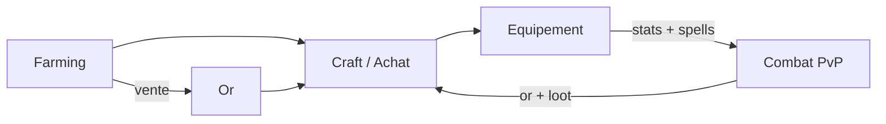
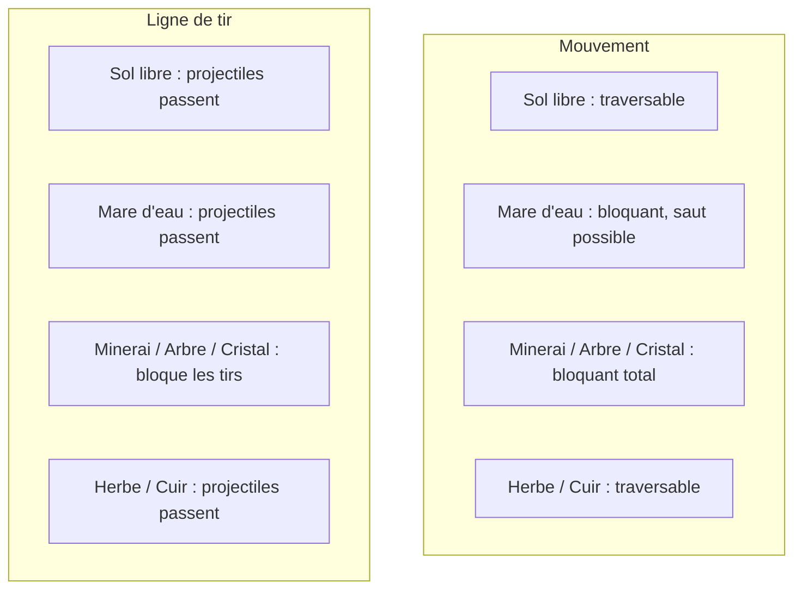
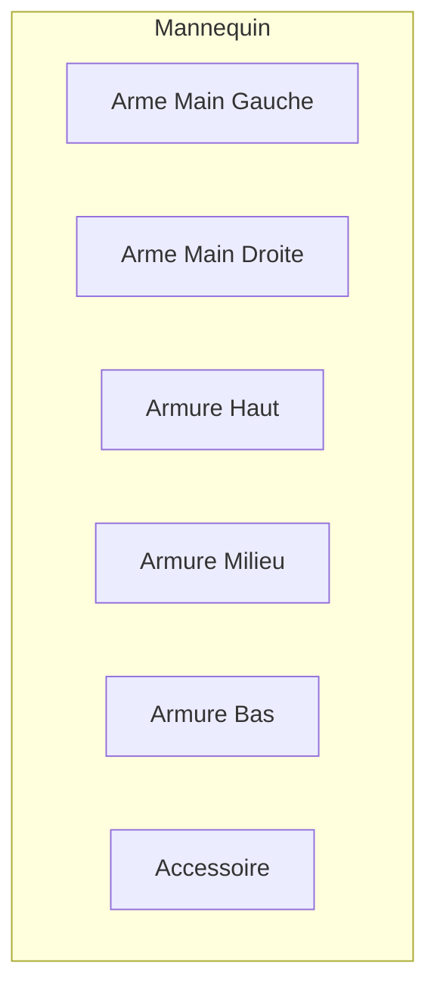
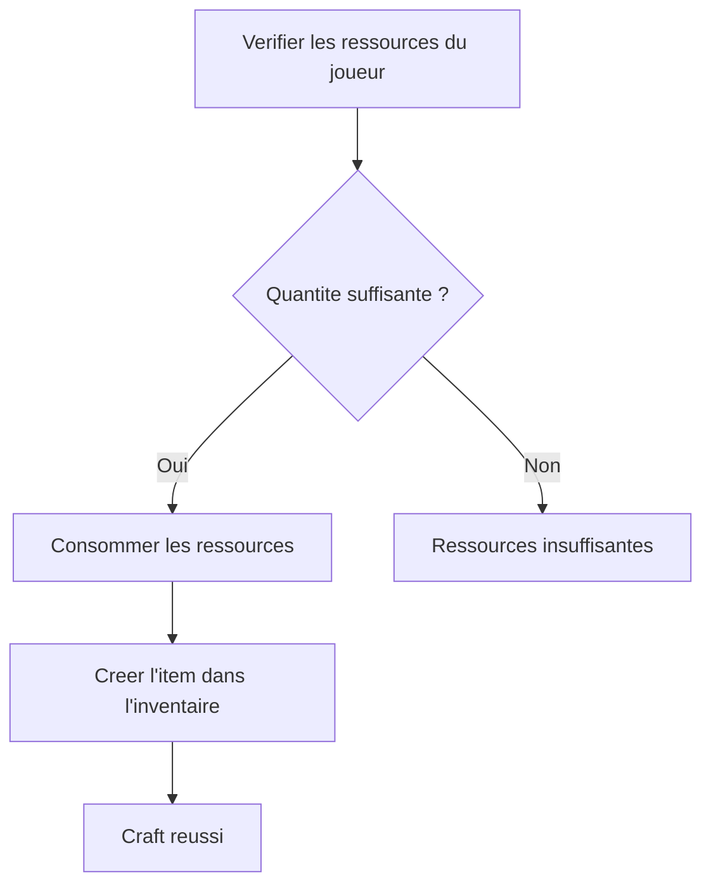
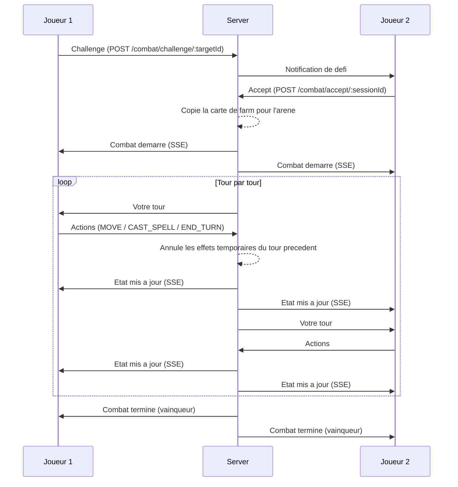
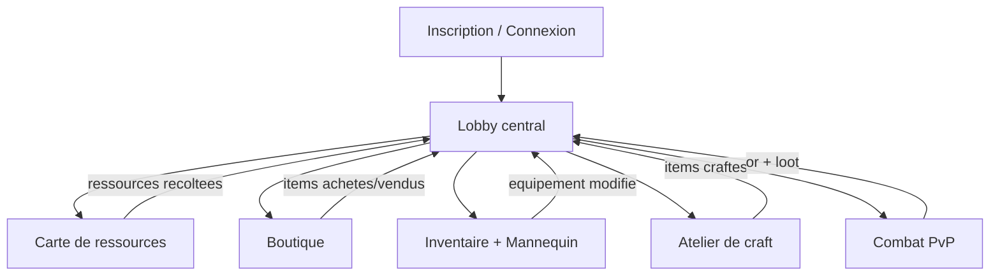

# Game Design Document — Dofus-Like

> Jeu de stratégie au tour par tour en navigateur, inspiré de Dofus.

---

## Table des matières

1. [Vision et concept](#1-vision-et-concept)
2. [Boucle de gameplay principale](#2-boucle-de-gameplay-principale)
3. [Carte et terrain](#3-carte-et-terrain)
4. [Système de farming de ressources](#3b-système-de-farming-de-ressources)
5. [Système d'items et équipement](#4-système-ditems-et-équipement)
6. [Système de crafting](#5-système-de-crafting)
7. [Système de shop / économie](#6-système-de-shop--économie)
8. [Système de combat](#7-système-de-combat)
9. [Stats et progression](#8-stats-et-progression)
10. [Parcours joueur](#9-parcours-joueur)
11. [Interface utilisateur](#10-interface-utilisateur)
12. [Événements inter-équipes](#11-événements-inter-équipes)
13. [État d'implémentation et roadmap](#12-état-dimplémentation-et-roadmap)

---

## 1. Vision et concept

### Pitch

Un jeu multijoueur web de stratégie au tour par tour inspiré de Dofus. Les joueurs explorent une carte pour récolter des ressources, gèrent leur économie via un shop et un système de crafting, s'équipent pour définir leurs stats et leur kit de sorts, puis s'affrontent dans des combats tactiques PvP sur grille. Trois archétypes d'équipement (Guerrier, Mage, Ninja) offrent des styles de jeu distincts, et les combinaisons d'items débloquent 9 spells évolutifs.

### Trois piliers

| Pilier | Description |
|--------|-------------|
| **Exploration** | Récolte de ressources sur une carte en vue 3D |
| **Économie** | Achat, vente et fabrication d'objets |
| **Combat PvP** | Affrontements tactiques au tour par tour sur grille |

### Contexte

Projet développé dans le cadre d'une game jam, conçu pour fonctionner entièrement dans un navigateur web. Deux équipes travaillent en parallèle :

- **Équipe A** — World + Economy (farming, items, shop, crafting)
- **Équipe B** — Combat (sessions, tours, sorts, carte de combat)

---

## 2. Boucle de gameplay principale



### Cycle complet

1. **Farmer** — Le joueur récolte des ressources (bois, minerai, herbes, cristaux, cuir) sur sa carte d'exploration.
2. **Transformer** — Il utilise ces ressources pour crafter des items ou les vend au shop.
3. **Acheter** — Il complète sa collection via la boutique avec l'or gagné.
4. **S'équiper** — Il place ses items sur le mannequin d'équipement (2 armes, 3 armures, 1 accessoire). Les stats et les spells sont définis par ce qui est équipé.
5. **Combattre** — Il défie un autre joueur en PvP au tour par tour, avec les stats et les sorts de son équipement actuel.
6. **Récolter les récompenses** — Le vainqueur gagne de l'or et potentiellement du loot.
7. **Recommencer** — Le cycle reprend.

---

## 3. Carte et terrain

Le jeu utilise **une seule et même carte** pour le farming et le combat. La carte est une grille **20×20** en vue 3D isométrique (Three.js), composée de différents types de terrain.

### Types de terrain

| Terrain | Traversable | Tir au travers | Saut par-dessus | Visuel |
|---------|-------------|----------------|-----------------|--------|
| **Sol libre** | Oui | Oui | — | Tuile plate |
| **Mare d'eau** | Non | Oui | Oui | Tuile bleue animée |
| **Minerai de Fer** | Non | Non | Non | Roche métallique, récoltable |
| **Minerai d'Or** | Non | Non | Non | Roche dorée, récoltable |
| **Bois de Frêne** | Non | Non | Non | Arbre, récoltable |
| **Herbe Médicinale** | Oui | Oui | — | Buisson au sol, récoltable |
| **Cristal d'Ombre** | Non | Non | Non | Cristal violet lumineux, récoltable |
| **Cuir Robuste** | Oui | Oui | — | Dépouille au sol, récoltable |

Les mares d'eau sont des obstacles de terrain permanents. Les nodes de ressources récoltables sont aussi des obstacles (sauf les petits ramassables au sol comme les herbes et le cuir).

### Propriétés de terrain pour le combat



### Carte immuable

Aucun joueur ne peut modifier durablement la carte. Les nodes de ressources récoltés respawnent, et toute modification temporaire (par exemple un consommable qui pose une défense au sol) est annulée au tour suivant.

---

## 3b. Système de farming de ressources

### Instances de farming

Chaque joueur farm dans **sa propre instance** de la carte. Les joueurs ne se voient pas pendant le farming. L'état des nodes de ressources est propre à chaque instance.

### Types de ressources

| Ressource | Type de terrain | Rareté | Prix de base (or) | Utilisation |
|-----------|----------------|--------|-------------------|-------------|
| Bois de Frêne | Arbre (bloquant) | Commun | 5 | Craft d'armes et armures |
| Minerai de Fer | Roche (bloquant) | Commun | 10 | Craft d'armes et armures |
| Minerai d'Or | Roche (bloquant) | Rare | 20 | Vente ou craft spécial |
| Herbe Médicinale | Buisson (traversable) | Commun | 8 | Craft de consommables |
| Cristal d'Ombre | Cristal (bloquant) | Rare | 25 | Craft d'anneaux magiques |
| Cuir Robuste | Dépouille (traversable) | Commun | 12 | Craft d'armures |

### Mécanique de récolte

1. Le joueur se déplace sur la carte (ou clique sur un node adjacent)
2. L'API est appelée (`POST /map/resources/:id/gather`)
3. La ressource est ajoutée à l'inventaire du joueur (quantité +1)
4. Le node disparaît de la carte dans l'instance du joueur
5. Le node réapparaît après un **cooldown** (respawn)

### Système de Rounds (Farming)

Le temps en mode exploration est découpé en **Rounds**. Un Round n'est pas une durée fixe en secondes, mais une unité de progression :
- **1 Round passe toutes les 5 actions** de récolte effectuées par le joueur.
- Ou via un bouton "Passer au Round suivant" (optionnel).

### Respawn

- Les nodes récoltés ne réapparaissent pas immédiatement.
- **Ressources communes** : Respawn au début du Round suivant (+1 Round).
- **Ressources rares** : Respawn après **3 Rounds**.
- Les nodes respawnent à leur position d'origine.

---

## 4. Système d'items et équipement

### Principe fondamental

Le joueur possède un **inventaire infini** (stockage) et un **mannequin d'équipement** avec des slots limités. Seuls les items placés sur le mannequin donnent leurs bonus de stats et contribuent au déblocage de spells. Les items en inventaire n'ont aucun effet passif.

### Mannequin d'équipement — Slots



| Slot | Type accepté | Max |
|------|-------------|-----|
| **Arme Main Gauche** | WEAPON | 1 |
| **Arme Main Droite** | WEAPON | 1 |
| **Armure Haut** | ARMOR_HEAD | 1 |
| **Armure Milieu** | ARMOR_CHEST | 1 |
| **Armure Bas** | ARMOR_LEGS | 1 |
| **Accessoire** | ACCESSORY | 1 |

Total : **6 slots** sur le mannequin (dont 2 armes).

### Types d'items

| Type | Description | Slot | Stackable |
|------|-------------|------|-----------|
| **WEAPON** | Armes (épée, bouclier, bâton, grimoire, kunaï, bombe du ninja) | Arme G/D | Non |
| **ARMOR_HEAD** | Heaume, chapeau de mage, bandeau | Armure Haut | Non |
| **ARMOR_CHEST** | Armure, toge de mage, kimono | Armure Milieu | Non |
| **ARMOR_LEGS** | Bottes de fer, bottes de mage, geta | Armure Bas | Non |
| **ACCESSORY** | Anneaux d'archétype (guerrier, mage, ninja) | Accessoire | Non |
| **CONSUMABLE** | Potions | — (utilisé depuis l'inventaire) | Oui |
| **RESOURCE** | Matériaux de craft | — (stockage) | Oui |

### Bonus de stats

Chaque item équipable possède un champ `statsBonus` (JSON) exprimé dans les nouvelles stats :

```json
{
  "vit": 15,
  "atk": 4,
  "mag": 0,
  "def": 2,
  "res": 0,
  "ini": 0,
  "pa": 0,
  "pm": 0
}
```

### Spells débloqués

Chaque item équipable possède aussi un champ `grantsSpells` (liste de spell IDs). Le système de rangs calcule le niveau de chaque spell en comptant le nombre de sources distinctes qui le débloquent (voir section 7).

---

### Les 3 archétypes

Il n'y a pas de classes en tant que telles. Le joueur est libre de mixer les items de n'importe quel archétype. Cependant, les items sont regroupés en 3 familles thématiques, et les **full sets d'armure** débloquent des spells bonus.

#### Rangs d'équipement (Épées et Armures)

Les pièces d'armure (Haut, Milieu, Bas) ainsi que les armes possèdent **3 rangs**. Chaque rang augmente les stats passives de l'objet.
- **Rang 1** : Se craft directement avec des ressources de base.
- **Rang 2** : S'obtient en fusionnant (merge) **2 exemplaires** de l'objet de Rang 1.
- **Rang 3** : S'obtient en fusionnant (merge) **2 exemplaires** de l'objet de Rang 2.

**Les accessoires (anneaux) n'ont qu'un seul rang unique.**

Le Full Set Guerrier / Mage / Ninja fonctionne quel que soit le rang des pièces : il suffit d'avoir les 3 slots d'armure équipés avec des pièces du même archétype.

#### Archétype Guerrier

**Armes (stats par rang) :**

| Item | Type | Slot | Rang 1 | Rang 2 | Rang 3 | Spells |
|------|------|------|--------|--------|--------|---------|
| Épée | WEAPON | Arme | ATK +4, VIT +5 | ATK +6, VIT +7 | ATK +9, VIT +10 | Frappe |
| Bouclier | WEAPON | Arme | DEF +4, VIT +10 | DEF +6, VIT +15 | DEF +9, VIT +20 | Endurance |

**Armures (stats par rang) :**

| Item | Slot | Rang 1 | Rang 2 | Rang 3 |
|------|------|--------|--------|--------|
| Heaume | Haut | DEF +2, VIT +10 | DEF +3, VIT +15 | DEF +5, VIT +20 |
| Armure | Milieu | DEF +3, VIT +15 | DEF +5, VIT +20 | DEF +7, VIT +30 |
| Bottes de Fer | Bas | DEF +2, PM +1 | DEF +3, PM +1, VIT +5 | DEF +5, PM +1, VIT +10 |

**Combos :**

| Combo | Condition | Spells débloqués |
|-------|-----------|------------------|
| **Full Set Guerrier** | Heaume + Armure + Bottes de Fer (tout rang) | Bond, Endurance |
| **Combo Épée + Bouclier** | Les deux équipés | Bond |

#### Archétype Mage

**Armes (stats par rang) :**

| Item | Type | Slot | Rang 1 | Rang 2 | Rang 3 | Spells |
|------|------|------|--------|--------|--------|---------|
| Bâton Magique | WEAPON | Arme | MAG +6, INI +2 | MAG +9, INI +3 | MAG +12, INI +4 | Boule de Feu |
| Grimoire | WEAPON | Arme | MAG +4, PA +1 | MAG +6, PA +1 | MAG +8, PA +1 | Menhir |

**Armures (stats par rang) :**

| Item | Slot | Rang 1 | Rang 2 | Rang 3 |
|------|------|--------|--------|--------|
| Chapeau de Mage | Haut | MAG +2, RES +2 | MAG +3, RES +3 | MAG +5, RES +5 |
| Toge de Mage | Milieu | RES +3, VIT +10, PA +1 | RES +5, VIT +15, PA +1 | RES +7, VIT +20, PA +1 |
| Bottes de Mage | Bas | RES +2, INI +3, PM +1 | RES +3, INI +4, PM +1 | RES +5, INI +5, PM +1 |

**Combos :**

| Combo | Condition | Spells débloqués |
|-------|-----------|------------------|
| **Full Set Mage** | Chapeau + Toge + Bottes de Mage (tout rang) | Menhir, Soin |
| **Combo Bâton + Grimoire** | Les deux équipés | Soin |

#### Archétype Ninja

**Armes (stats par rang) :**

| Item | Type | Slot | Rang 1 | Rang 2 | Rang 3 | Spells |
|------|------|------|--------|--------|--------|---------|
| Kunaï | WEAPON | Arme | ATK +5, INI +3 | ATK +7, INI +4 | ATK +10, INI +5 | Lancer de Kunaï |
| Bombe du Ninja | WEAPON | Arme | ATK +3, INI +2 | ATK +5, INI +3 | ATK +7, INI +4 | Bombe de Repousse |

**Armures (stats par rang) :**

| Item | Slot | Rang 1 | Rang 2 | Rang 3 |
|------|------|--------|--------|--------|
| Bandeau | Haut | INI +4, PM +1 | INI +6, PM +1 | INI +8, PM +2 |
| Kimono | Milieu | INI +3, PM +1 | INI +5, PM +1 | INI +7, PM +2 |
| Geta | Bas | PM +2, INI +2 | PM +2, INI +4 | PM +3, INI +6 |

**Combos :**

| Combo | Condition | Spells débloqués |
|-------|-----------|------------------|
| **Full Set Ninja** | Bandeau + Kimono + Geta (tout rang) | Bombe de Repousse, Vélocité |
| **Combo Kunaï + Bombe du Ninja** | Les deux équipés | Vélocité |

#### Anneaux d'archétype (Accessoires)

Un seul anneau équipable à la fois. Chaque anneau débloque les deux spells secondaires de son archétype.

| Item | Stats bonus | Spells débloqués | Prix / Craft |
|------|-------------|------------------|-------------|
| Anneau de Guerrier | DEF +3, PM +1 | Bond, Endurance | 3 Minerai de Fer, 2 Cristal d'Ombre |
| Anneau du Mage | MAG +3, PA +1 | Menhir, Soin | 3 Cristal d'Ombre, 2 Herbe Médicinale |
| Anneau du Ninja | INI +3, PM +1 | Bombe de Repousse, Vélocité | 3 Cristal d'Ombre, 2 Cuir Robuste |

#### Consommables

| Nom | Effet | Prix shop | Craft |
|-----|-------|-----------|-------|
| Potion de Soin | Restaure 30 VIT en combat | 25 or | 2 Herbe Médicinale |
| Barricade | Pose un menhir temporaire sur une case (bloque mouvement + ligne de vue, disparaît au tour suivant) | 30 or | 3 Bois de Frêne, 1 Minerai de Fer |

---

## 5. Système de crafting

### Principe

Le crafting repose sur deux mécaniques : la **fabrication initiale** (Rang 1) et la **fusion** (Merge) pour les rangs supérieurs.

- **Craft Rang 1 / Anneaux / Consommables** : Utilise des ressources récoltées.
- **Merge (Rang 2 & 3)** : Fusionne deux items de rang identique pour obtenir le rang supérieur. Cette opération ne coûte pas d'or ni de ressources supplémentaires, mais consomme les deux items sources.

### Flux de craft



1. Le joueur sélectionne une recette
2. Le système vérifie que le joueur possède toutes les ressources requises
3. Les ressources sont consommées (transaction atomique)
4. L'item crafté est ajouté à l'inventaire (quantité +1)

#### Recettes de Fusion (Merge) — Épées & Armures

| Item Cible | Rang | Ingrédients |
|------------|------|-------------|
| N'importe quelle Arme / Armure | **Rang 2** | 2× [Même Objet] Rang 1 |
| N'importe quelle Arme / Armure | **Rang 3** | 2× [Même Objet] Rang 2 |

#### Recettes de Fabrication (Rang 1) — Guerrier

| Item crafté | Rang | Ingrédients |
|-------------|------|-------------|
| Épée | R1 | 10× Minerai de Fer, 5× Bois de Frêne |
| Bouclier | R1 | 8× Minerai de Fer, 4× Cuir Robuste |
| Heaume | R1 | 5× Minerai de Fer, 3× Cuir Robuste |
| Armure | R1 | 8× Minerai de Fer, 5× Cuir Robuste |
| Bottes de Fer | R1 | 4× Minerai de Fer, 3× Cuir Robuste |

#### Recettes de Fabrication (Rang 1) — Mage

| Item crafté | Rang | Ingrédients |
|-------------|------|-------------|
| Bâton Magique | R1 | 12× Cristal d'Ombre, 6× Bois de Frêne |
| Grimoire | R1 | 10× Cristal d'Ombre, 5× Herbe Médicinale |
| Chapeau de Mage | R1 | 3× Cristal d'Ombre, 2× Herbe Médicinale |
| Toge de Mage | R1 | 4× Cristal d'Ombre, 3× Cuir Robuste |
| Bottes de Mage | R1 | 2× Cristal d'Ombre, 2× Herbe Médicinale |

#### Recettes de Fabrication (Rang 1) — Ninja

| Item crafté | Rang | Ingrédients |
|-------------|------|-------------|
| Kunaï | R1 | 8× Cuir Robuste, 4× Minerai de Fer |
| Bombe du Ninja | R1 | 6× Cuir Robuste, 3× Cristal d'Ombre |
| Bandeau | R1 | 3× Cuir Robuste, 2× Herbe Médicinale |
| Kimono | R1 | 5× Cuir Robuste, 3× Herbe Médicinale |
| Geta | R1 | 4× Cuir Robuste, 2× Minerai de Fer |

#### Anneaux

| Item crafté | Ingrédients |
|-------------|-------------|
| Anneau de Guerrier | 3× Minerai de Fer, 2× Cristal d'Ombre |
| Anneau du Mage | 3× Cristal d'Ombre, 2× Herbe Médicinale |
| Anneau du Ninja | 3× Cristal d'Ombre, 2× Cuir Robuste |

#### Consommables

| Item crafté | Ingrédients |
|-------------|-------------|
| Potion de Soin | 2× Herbe Médicinale |
| Barricade | 3× Bois de Frêne, 1× Minerai de Fer |

---

## 6. Système de shop / économie

### Monnaie

- Unité : **or** (gold)
- Or de départ : **100** à la création du compte
- Gains : vente de ressources/items, récompenses de combat

### Boutique PNJ

La boutique propose des items à prix fixe. Seuls les items avec un `shopPrice` non nul apparaissent.

#### Achat

- Le joueur achète un item pour `shopPrice × quantité`
- L'or est déduit, l'item est ajouté à l'inventaire
- Si l'item existe déjà dans l'inventaire, la quantité est incrémentée

#### Vente

- Le joueur vend un item de son inventaire
- Le prix de vente est de **50%** du `shopPrice`
- Si la quantité tombe à 0, l'entrée est supprimée de l'inventaire

### Grille tarifaire

| Catégorie | Fourchette de prix |
|-----------|--------------------|
| Ressources communes | 5 – 15 or |
| Ressources rares | 20 – 30 or |
| Armes | 50 – 80 or |
| Armures (craftables uniquement) | — (non vendues en shop) |
| Anneaux (craftables uniquement) | — (non vendus en shop) |
| Consommables | 25 – 30 or |

### Équilibrage économique

- Un combat gagné rapporte ~50 or
- Un cycle complet de farming (vider la carte) rapporte ~100-150 or en vente de ressources
- Les armes s'achètent au shop, les armures et anneaux se craftent uniquement — cela force le farming
- Un joueur full équipé nécessite : 2 armes (shop) + 3 armures (craft) + 1 anneau (craft)
- Attention : vendre un item équipé = perte de stats ET potentiellement de spells

---

## 7. Système de combat

### Vue d'ensemble

Combat PvP au tour par tour sur la **même carte que le farming** (grille 20×20), en vue 3D isométrique. L'arène de combat est une **copie figée** de la carte de farm : les mêmes mares d'eau, minerais, arbres et cristaux sont présents et appliquent les mêmes règles de terrain (voir section 3).

### Carte de combat = copie de la carte de farm

- **Grille** : 20×20 (identique au farming)
- **Terrain** : copié depuis la carte de farm au moment du lancement du combat
- **Spawn** : Joueur 1 et Joueur 2 placés dans des zones de spawn prédéfinies (coins opposés sur des cases libres)
- **Immutabilité** : aucune modification permanente de la carte pendant le combat. Les effets temporaires (consommable de défense au sol) sont annulés au tour suivant.

### Interactions terrain en combat

| Terrain | Mouvement | Ligne de tir | Saut |
|---------|-----------|-------------|------|
| Sol libre | Libre | Libre | — |
| Mare d'eau | Bloqué | Libre (tir au travers) | Possible (1 MP = sauter par-dessus) |
| Minerai / Arbre / Cristal | Bloqué | Bloqué (coupe la ligne de vue) | Impossible |
| Herbe / Cuir (ramassables) | Libre | Libre | — |

La ligne de tir est évaluée en traçant une droite entre le lanceur et la cible. Si un terrain bloquant la ligne de vue se trouve sur le chemin, le sort ne peut pas atteindre la cible.

### Déroulement d'un combat



### Système de tours

- Les tours alternent entre les deux joueurs (round-robin)
- **Au début de chaque tour** : les AP et MP du joueur actif sont réinitialisés à leur maximum, les cooldowns des sorts sont décrémentés de 1, et **toutes les modifications temporaires de la carte sont annulées** (défenses posées, etc.)
- Un joueur peut effectuer plusieurs actions par tour tant qu'il a des AP/MP

### Actions

| Action | Coût | Règle |
|--------|------|-------|
| **MOVE** | 1 MP par case (Manhattan) | Le joueur se déplace vers une case traversable. Pas de mouvement en diagonale. |
| **JUMP** | 1 MP | Le joueur saute par-dessus une mare d'eau adjacente pour atterrir de l'autre côté (case libre requise). |
| **CAST_SPELL** | AP (coût du sort) | Le joueur lance un sort sur une cible à portée ET en ligne de vue. AP suffisants et pas en cooldown. |
| **END_TURN** | — | Termine le tour du joueur actif. Passe au joueur suivant. |

### Ligne de vue

Un sort ne peut atteindre sa cible que si la **ligne de vue** n'est pas obstruée. Les terrains qui bloquent la ligne de vue sont : minerais, arbres, cristaux. Les mares d'eau et les cases vides ne bloquent pas.

### Les 9 Spells

Les spells ne sont pas appris directement. Ils sont **débloqués par les items équipés** et leurs combinaisons. Chaque source qui accorde un spell ajoute **+1 à son niveau** (max 3). Plus le niveau est élevé, plus le spell est puissant.

#### Système de rangs (niveaux de spell)

```
niveau_spell = nombre de sources distinctes qui accordent ce spell (équipées)
max = 3
```

Exemple : le spell **Bond** peut être obtenu par 3 sources :
- Anneau de Guerrier (équipé) = +1
- Combo Épée + Bouclier (les deux équipés) = +1
- Full Set Guerrier (Heaume + Armure + Bottes de Fer équipées) = +1
- Total = lvl 3

#### Tableau des 9 spells

##### 1. Frappe (Dégât CaC)

| | Lvl 1 | Lvl 2 | Lvl 3 |
|---|-------|-------|-------|
| **Canal** | Physique | Physique | Physique |
| **Coût PA** | 3 | 3 | 3 |
| **Portée** | 1 (CaC) | 1 | 1 |
| **Dégâts** | 8–12 + ATK | 12–18 + ATK | 18–25 + ATK |
| **Cooldown** | 0 | 0 | 0 |
| **Spécial** | — | — | Ignore 50% de la DEF adverse |

**Sources :** Épée (seule source, max lvl 1 par défaut — lvl 2 et 3 atteignables si d'autres armes de type épée sont ajoutées plus tard)

##### 2. Bond (Mobilité / Saut)

| | Lvl 1 | Lvl 2 | Lvl 3 |
|---|-------|-------|-------|
| **Coût PA** | 2 | 2 | 2 |
| **Portée de saut** | 2 cases | 3 cases | 4 cases |
| **Cooldown** | 2 | 1 | 0 |
| **Spécial** | Saute par-dessus obstacles et eau | idem | idem + ne déclenche pas de dégâts de passage |

**Sources :** Combo Épée+Bouclier, Anneau de Guerrier, Full Set Guerrier

##### 3. Endurance (Buff Défense)

| | Lvl 1 | Lvl 2 | Lvl 3 |
|---|-------|-------|-------|
| **Coût PA** | 2 | 2 | 2 |
| **Portée** | 0 (soi-même) | 0 | 0 |
| **Effet** | DEF +3 pendant 2 tours | DEF +5 pendant 2 tours | DEF +8 pendant 3 tours |
| **Cooldown** | 3 | 3 | 2 |

**Sources :** Bouclier, Anneau de Guerrier, Full Set Guerrier

##### 4. Menhir (Invocation d'obstacle)

| | Lvl 1 | Lvl 2 | Lvl 3 |
|---|-------|-------|-------|
| **Coût PA** | 3 | 3 | 3 |
| **Portée** | 1–3 | 1–4 | 1–5 |
| **Effet** | Invoque un menhir (bloque mouvement + LdV) sur 1 case, dure 2 tours | dure 3 tours | dure 3 tours + 2 menhirs invocables |
| **Cooldown** | 3 | 2 | 2 |

**Sources :** Grimoire, Anneau du Mage, Full Set Mage

##### 5. Boule de Feu (Dégât magique distance)

| | Lvl 1 | Lvl 2 | Lvl 3 |
|---|-------|-------|-------|
| **Canal** | Magique | Magique | Magique |
| **Coût PA** | 4 | 4 | 4 |
| **Portée** | 1–5 | 1–6 | 1–7 |
| **Dégâts** | 12–20 + MAG | 18–28 + MAG | 25–35 + MAG |
| **Cooldown** | 1 | 1 | 0 |
| **Spécial** | — | — | Dégâts de zone : cible + 4 cases adjacentes (50% dégâts) |

**Sources :** Bâton Magique (seule source, max lvl 1 par défaut)

##### 6. Lancer de Kunaï (Dégât physique distance)

| | Lvl 1 | Lvl 2 | Lvl 3 |
|---|-------|-------|-------|
| **Canal** | Physique | Physique | Physique |
| **Coût PA** | 3 | 3 | 3 |
| **Portée** | 1–4 | 1–5 | 1–6 |
| **Dégâts** | 8–14 + ATK | 12–20 + ATK | 16–24 + ATK |
| **Cooldown** | 0 | 0 | 0 |
| **Spécial** | — | — | 2 lancers par tour |

**Sources :** Kunaï (seule source, max lvl 1 par défaut)

##### 7. Bombe de Repousse (Push physique AoE)

| | Lvl 1 | Lvl 2 | Lvl 3 |
|---|-------|-------|-------|
| **Canal** | Physique | Physique | Physique |
| **Coût PA** | 3 | 3 | 3 |
| **Portée** | 1–3 | 1–4 | 1–5 |
| **Dégâts** | 5–8 + ATK | 8–12 + ATK | 10–15 + ATK |
| **Repousse** | 1 case | 2 cases | 3 cases |
| **Cooldown** | 2 | 2 | 1 |
| **Spécial** | Repousse la cible dans la direction du tir | idem | idem + si la cible heurte un obstacle, dégâts bonus (+50%) |

**Sources :** Bombe du Ninja, Anneau du Ninja, Full Set Ninja

##### 8. Vélocité (Buff PM)

| | Lvl 1 | Lvl 2 | Lvl 3 |
|---|-------|-------|-------|
| **Coût PA** | 2 | 2 | 2 |
| **Portée** | 0 (soi-même) | 0 | 0 |
| **Effet** | PM +2 pendant 1 tour | PM +3 pendant 2 tours | PM +4 pendant 2 tours |
| **Cooldown** | 3 | 2 | 2 |
| **Spécial** | — | — | Accorde aussi INI +5 pendant la durée |

**Sources :** Combo Kunaï+Bombe du Ninja, Anneau du Ninja, Full Set Ninja

##### 9. Soin (Heal magique)

| | Lvl 1 | Lvl 2 | Lvl 3 |
|---|-------|-------|-------|
| **Canal** | Magique | Magique | Magique |
| **Coût PA** | 3 | 3 | 3 |
| **Portée** | 0 (soi-même) | 0 | 0–2 (peut soigner un allié en 2v2 futur) |
| **Soin** | 15–20 + 50% MAG | 22–30 + 50% MAG | 30–40 + 50% MAG |
| **Cooldown** | 2 | 2 | 1 |

**Sources :** Combo Bâton+Grimoire, Anneau du Mage, Full Set Mage

#### Récapitulatif des sources par spell

| Spell | Source 1 | Source 2 | Source 3 |
|-------|----------|----------|----------|
| Frappe | Épée | — | — |
| Bond | Combo Épée+Bouclier | Anneau de Guerrier | Full Set Guerrier |
| Endurance | Bouclier | Anneau de Guerrier | Full Set Guerrier |
| Menhir | Grimoire | Anneau du Mage | Full Set Mage |
| Boule de Feu | Bâton Magique | — | — |
| Lancer de Kunaï | Kunaï | — | — |
| Bombe de Repousse | Bombe du Ninja | Anneau du Ninja | Full Set Ninja |
| Vélocité | Combo Kunaï+Bombe du Ninja | Anneau du Ninja | Full Set Ninja |
| Soin | Combo Bâton+Grimoire | Anneau du Mage | Full Set Mage |

### Formules

**Dégâts physiques** (Frappe, Lancer de Kunaï, Bombe de Repousse) :
```
degats_base = sort.damage.min + random(0, sort.damage.max - sort.damage.min)
degats_bruts = degats_base + ATK_lanceur
degats_finaux = max(1, degats_bruts - DEF_cible)
```

**Dégâts magiques** (Boule de Feu) :
```
degats_base = sort.damage.min + random(0, sort.damage.max - sort.damage.min)
degats_bruts = degats_base + MAG_lanceur
degats_finaux = max(1, degats_bruts - RES_cible)
```

**Soin** (scaling magique) :
```
soin_base = sort.heal.min + random(0, sort.heal.max - sort.heal.min)
soin_effectif = soin_base + floor(MAG_lanceur * 0.5)
```

**Initiative (ordre du premier tour) :**
```
score = INI + random(0, 9)
```

**Portée (distance Manhattan) :**
```
distance = |cible.x - lanceur.x| + |cible.y - lanceur.y|
valide si : sort.minRange <= distance <= sort.maxRange ET ligne de vue libre
```

**Repousse (Bombe de Repousse) :**
```
direction = vecteur normalisé du lanceur vers la cible
la cible est poussée de N cases dans cette direction
si obstacle rencontré : arrêt + dégâts bonus (lvl 3)
```

### Condition de victoire

Le combat se termine quand la Vitalité d'un joueur tombe à **0 ou moins**. Le joueur restant est déclaré vainqueur.

### Récompenses

| Résultat | Récompense |
|----------|------------|
| Victoire | +50 or, loot possible |
| Défaite | rien |

### Effets temporaires

- Les **menhirs invoqués** (spell Menhir) bloquent mouvement et ligne de vue. Ils disparaissent après leur durée.
- Les **barricades** (consommable) fonctionnent de la même manière mais disparaissent au tour suivant.
- Les **buffs** (Endurance, Vélocité) durent un nombre de tours défini et se décrémentent à chaque début de tour du joueur.

---

## 8. Stats et progression

### Stats de base

Chaque joueur commence avec les stats suivantes :

| Stat | Abréviation | Valeur de base | Description |
|------|-------------|----------------|-------------|
| **Vitalité** | VIT | 100 | Points de vie du joueur |
| **Attaque** | ATK | 5 | Augmente les dégâts des sorts **physiques** (Frappe, Kunaï, Bombe) |
| **Magie** | MAG | 0 | Augmente les dégâts des sorts **magiques** (Boule de Feu, Soin, Menhir) |
| **Défense** | DEF | 0 | Réduit les dégâts **physiques** reçus |
| **Résistance Magique** | RES | 0 | Réduit les dégâts **magiques** reçus |
| **Initiative** | INI | 10 | Détermine qui joue en premier au début du combat |
| **Points d'Action** | PA | 6 | Ressource dépensée pour lancer des sorts |
| **Points de Mouvement** | PM | 3 | Ressource dépensée pour se déplacer sur la grille |

### Deux canaux de dégâts

Le jeu distingue les dégâts **physiques** et **magiques** :

| Canal | Stat offensive | Stat défensive | Sorts concernés |
|-------|---------------|----------------|-----------------|
| **Physique** | ATK | DEF | Frappe, Lancer de Kunaï, Bombe de Repousse |
| **Magique** | MAG | RES | Boule de Feu, Soin (scaling), Menhir (dégâts de pose futur) |

Le stuff Guerrier et Ninja donne principalement ATK et DEF. Le stuff Mage donne principalement MAG et RES.

### Stats effectives

Les stats effectives sont calculées à partir des **items équipés sur le mannequin** uniquement. Pour les armures et armes, les stats dépendent du **rang** de la pièce équipée :

```
stat_effective = stat_base + somme(statsBonus de chaque item ÉQUIPÉ selon son rang)
```

Seuls les items placés sur un slot du mannequin contribuent aux stats. Les items stockés dans l'inventaire n'ont aucun effet passif.

Par exemple, un joueur avec 5 ATK de base qui équipe une Épée (ATK +4) et une Armure R1 (DEF +3, VIT +15) aura : ATK 9, DEF 3, VIT 115, MAG 0. S'il upgrade son Armure en R3 (DEF +7, VIT +30) : ATK 9, DEF 7, VIT 130, MAG 0.

Un mage avec un Bâton Magique (MAG +6) et une Toge de Mage R2 (RES +5, VIT +15) aura : MAG 6, RES 5, VIT 115.

### Spells débloqués par l'équipement

Au-delà des stats, les items équipés (et leurs combinaisons) débloquent des **spells** avec un système de rangs (voir section 7). Changer d'équipement change directement les sorts disponibles en combat.

### Pas de niveaux

Le jeu ne comporte pas de système de niveaux ou d'XP. La progression se fait uniquement par l'acquisition et l'équipement d'items plus puissants. Le choix d'équipement définit à la fois les stats et le kit de sorts du joueur.

---

## 9. Parcours joueur

### Flux complet



### Étapes détaillées

1. **Inscription** — Le joueur crée un compte (username, email, mot de passe). Il reçoit 100 or, des stats de base, et un inventaire vide.
2. **Connexion** — Authentification JWT. Le token est stocké côté client.
3. **Lobby** — Hub central affichant l'or du joueur, son pseudo, ses stats effectives, ses spells actifs, et 5 accès :
   - Carte des Ressources
   - Boutique
   - Inventaire / Mannequin
   - Crafting
   - Combat
4. **Première session type** :
   - Aller au shop, acheter une Épée (50 or)
   - Aller dans l'inventaire, équiper l'Épée en main droite — le spell Frappe se débloque
   - Aller sur la carte, farmer du minerai et du cuir
   - Crafter un Bouclier, l'équiper en main gauche — le combo Épée+Bouclier débloque le spell Bond
   - Défier un autre joueur en combat avec Frappe (lvl 1) et Bond (lvl 1)
   - Gagner, recevoir 50 or
   - Farmer davantage pour crafter le Full Set Guerrier et monter Bond au lvl 2

---

## 10. Interface utilisateur

### Charte graphique

| Élément | Valeur |
|---------|--------|
| Fond principal | `#0a0e17` (bleu très foncé) |
| Surface carte/panel | `#1a2332` |
| Couleur primaire | `#6366f1` (indigo) |
| Couleur accent | `#f59e0b` (ambre / or) |
| Succès | `#10b981` (vert) |
| Danger | `#ef4444` (rouge) |
| Soin | `#34d399` (vert clair) |
| Texte principal | `#e2e8f0` |
| Texte secondaire | `#94a3b8` |
| Bordures | `#2d3748` |
| Police | Inter |
| Border radius | 8px |

### Pages

| Page | Route | Description |
|------|-------|-------------|
| **Login** | `/login` | Formulaire connexion / inscription avec onglets |
| **Lobby** | `/` | Hub central avec or, pseudo, stats, spells actifs, et navigation |
| **Carte de ressources** | `/map` | Grille 3D 20×20 avec terrain varié et nodes cliquables |
| **Boutique** | `/shop` | Grille de cartes d'items avec prix, stats bonus, et boutons acheter/vendre |
| **Inventaire** | `/inventory` | Mannequin d'équipement (6 slots) + liste d'items en inventaire avec drag & drop |
| **Crafting** | `/crafting` | Liste de recettes par archétype avec ingrédients requis et bouton crafter |
| **Combat** | `/combat/:sessionId` | Grille 3D 20×20 avec HUD (VIT, PA, PM, spells) |

### Page Inventaire — Mannequin

Layout en deux colonnes :
- **Gauche** : le mannequin avec les 6 slots visuels (Main G, Main D, Haut, Milieu, Bas, Accessoire). Le joueur glisse un item depuis l'inventaire vers un slot compatible.
- **Droite** : la liste de tous les items possédés (stockage infini), avec quantité, type, stats bonus, et bouton vendre.
- **Bas** : résumé des stats effectives actuelles et liste des spells débloqués avec leur niveau.

### Composants 3D (Three.js)

- **Carte de ressources** : `ResourceMapScene` — Grille 20×20 avec terrain varié (eau, roches, arbres, buissons), nodes récoltables avec couleurs par type, survol avec highlight
- **Carte de combat** : `CombatMapScene` — Même carte 20×20 avec terrain identique, menhirs invoqués en volume, joueurs en capsules colorées (indigo vs ambre)
- **Caméra** : Orthographique, vue de dessus

### HUD de combat

- Barre de VIT (verte -> rouge selon %)
- Compteurs PA et PM
- Barre de spells (jusqu'à 9, affiche le niveau avec des pips, désactivés si cooldown ou PA insuffisants)
- Indicateur de tour ("Votre tour" / "Tour adverse")
- Indicateur de buffs actifs (Endurance, Vélocité) avec durée restante
- Bouton "Fin de tour"

---

## 11. Événements inter-équipes

Les deux équipes communiquent via un système d'événements (NestJS EventEmitter).

### Contrat

| Événement | Émis par | Consommé par | Payload attendu |
|-----------|----------|-------------|-----------------|
| `player.item.equipped` | Équipe A | Équipe B | `{ playerId, itemId, slot }` |
| `player.item.unequipped` | Équipe A | Équipe B | `{ playerId, itemId, slot }` |
| `player.spells.changed` | Équipe A | Équipe B | `{ playerId, spells: [{ spellId, level }] }` |
| `combat.ended` | Équipe B | Équipe A | `{ sessionId, winnerId, loserId }` |
| `combat.player.died` | Équipe B | Équipe A | `{ sessionId, playerId }` |

### Cas d'usage

- Quand un joueur **équipe ou déséquipe un item**, ses stats effectives et ses spells sont recalculés. Les événements `player.item.equipped` / `player.item.unequipped` et `player.spells.changed` notifient l'équipe combat.
- Quand un **combat se termine**, l'équipe économie distribue les récompenses (or, loot) au vainqueur.

---

## 12. État d'implémentation et roadmap

### Vue d'ensemble

| Feature | Backend | Frontend | Seed/Data | Statut |
|---------|---------|----------|-----------|--------|
| Authentification (JWT) | OK | OK | OK | Complet |
| Lobby | — | OK (ancien design) | — | A adapter |
| Carte partagée + types de terrain | Non implémenté | Partiel (grille simple sans types) | — | A faire (refonte majeure) |
| Instances de farming séparées | Non implémenté | — | — | A faire |
| Carte de ressources connectée API | OK (endpoints) | Non connecté | 2 ressources | A compléter |
| Mannequin d'équipement (6 slots) | Non implémenté (ancien equip simple) | Non implémenté | — | A faire (refonte majeure) |
| Nouveau système de stats (VIT/ATK/DEF/INI/PA/PM) | Non implémenté | — | — | A faire |
| 9 spells avec rangs (lvl 1-3) | Non implémenté | — | — | A faire |
| Détection combos et full sets | Non implémenté | — | — | A faire |
| 3 archétypes d'items (Guerrier/Mage/Ninja) | Non implémenté | — | Seed à refaire | A faire |
| 6 anneaux magiques | Non implémenté | — | — | A faire |
| Boutique — affichage | OK | OK | OK | Complet |
| Boutique — achat | OK | Bouton non câblé | OK | A compléter |
| Boutique — vente | OK | Pas d'UI | OK | A compléter |
| Crafting | OK (logique) | Pas de page UI | Aucune recette | A faire |
| Arène = copie de la carte de farm | Non implémenté | — | — | A faire |
| Ligne de vue en combat | Non implémenté | — | — | A faire |
| Combat — sessions | OK | OK | — | Complet |
| Combat — tours / actions | Partiel | Partiel | — | En cours (Équipe B) |
| Combat — 9 spells (effets) | Non implémenté | — | — | A faire (Équipe B) |
| Combat — buffs temporaires | Non implémenté | — | — | A faire (Équipe B) |
| Combat — menhirs invoqués | Non implémenté | — | — | A faire (Équipe B) |
| Combat — repousse (bombe) | Non implémenté | — | — | A faire (Équipe B) |
| Combat — victoire | Non implémenté | — | — | A faire (Équipe B) |
| Récompenses combat | Non implémenté | — | — | A faire |
| Événements inter-équipes | Émission partielle (ancien design) | — | — | A refaire |

### Priorités Équipe A (World + Economy)

| Priorité | Tâche |
|----------|-------|
| Haute | Refondre le modèle de données : nouveaux ItemTypes (WEAPON, ARMOR_HEAD/CHEST/LEGS, ACCESSORY), nouvelles stats (VIT/ATK/DEF/INI/PA/PM) |
| Haute | Implémenter le mannequin d'équipement avec 6 slots (backend + frontend) |
| Haute | Implémenter le système de détection de combos et full sets pour le déblocage de spells |
| Haute | Implémenter la carte partagée avec types de terrain (eau, minerais, arbres, cristaux, herbes, cuir) |
| Haute | Créer le seed complet : 6 armes, 9 armures (3 sets), 6 anneaux, 2 consommables, 6 ressources |
| Haute | Connecter la carte de ressources à l'API (farming persisté) |
| Haute | Câbler le bouton acheter dans le shop |
| Haute | Créer la page inventaire avec mannequin (drag & drop) |
| Haute | Créer la page crafting avec UI (recettes par archétype) |
| Moyenne | Implémenter les instances de farming séparées par joueur |
| Moyenne | Ajouter l'UI de vente (shop + inventaire) |
| Moyenne | Écouter `combat.ended` pour distribuer les récompenses |
| Moyenne | Respawn des ressources par système de Rounds |
| Basse | Afficher les stats bonus et spells débloqués dans le lobby |

### Priorités Équipe B (Combat)

| Priorité | Tâche |
|----------|-------|
| Haute | Copier la carte de farm comme arène de combat (grille 20x20 avec terrain) |
| Haute | Implémenter la ligne de vue (terrain bloquant vs transparent) |
| Haute | Implémenter les 9 spells avec leurs effets par niveau |
| Haute | Implémenter le système de buffs temporaires (Endurance, Vélocité) |
| Haute | Implémenter le menhir invoqué (obstacle temporaire) |
| Haute | Implémenter la repousse (Bombe de Repousse, collision avec obstacles) |
| Haute | Implémenter le saut (Bond) par-dessus obstacles/eau |
| Haute | Utiliser `PlayerStatsService` avec nouvelles stats (VIT/ATK/DEF/INI/PA/PM) |
| Haute | Implémenter la condition de victoire (VIT <= 0) |
| Haute | Câbler les actions de mouvement et sorts depuis l'UI (barre de 9 spells) |
| Moyenne | Charger les spells du joueur depuis son équipement (combos + rangs) |
| Moyenne | Émettre `combat.ended` et `combat.player.died` |
| Basse | Historique des combats |
