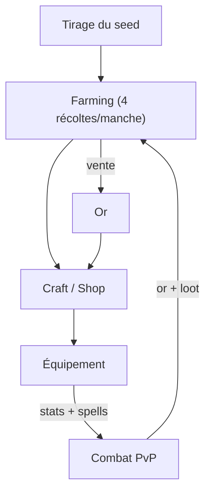
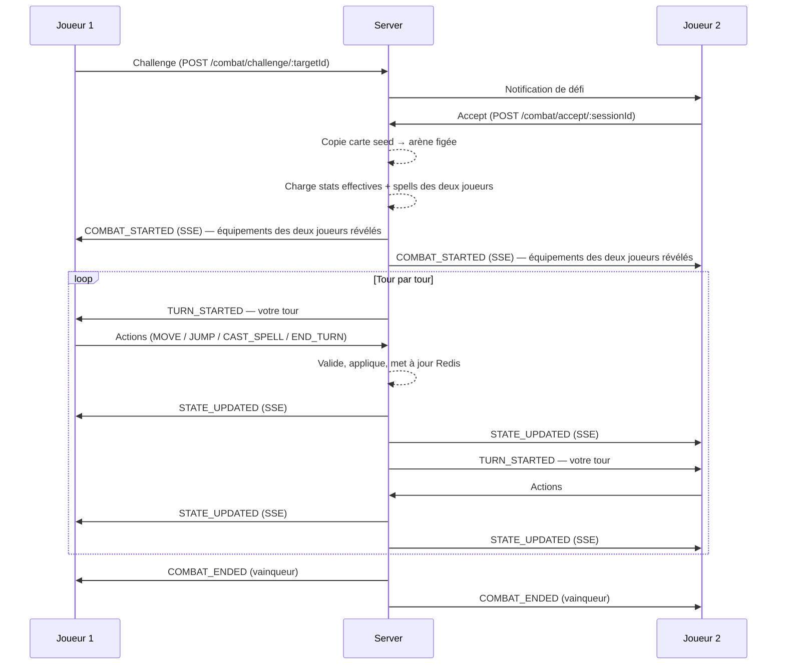
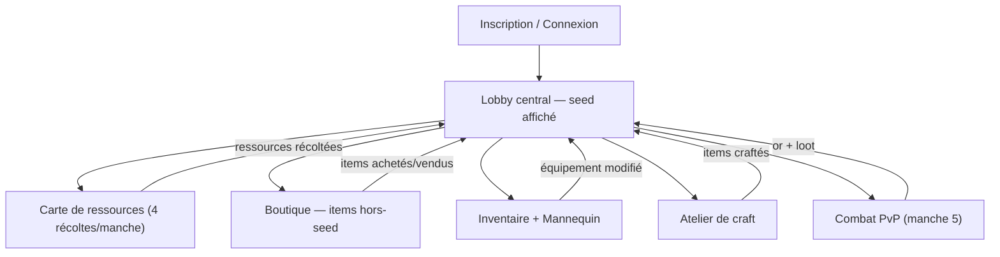

# Game Design Document — Moyenax v2

> Jeu de stratégie au tour par tour en navigateur, inspiré de Dofus.

---

## Table des matières

1. [Vision et concept](#1-vision-et-concept)
2. [Boucle de gameplay principale](#2-boucle-de-gameplay-principale)
3. [Familles de ressources et seeds de partie](#3-familles-de-ressources-et-seeds-de-partie)
4. [Carte et terrain](#4-carte-et-terrain)
5. [Système de farming de ressources](#5-système-de-farming-de-ressources)
6. [Système d'items et équipement](#6-système-ditems-et-équipement)
7. [Système de crafting](#7-système-de-crafting)
8. [Système de shop / économie](#8-système-de-shop--économie)
9. [Système de combat](#9-système-de-combat)
10. [Stats et progression](#10-stats-et-progression)
11. [Parcours joueur](#11-parcours-joueur)
12. [Interface utilisateur](#12-interface-utilisateur)
13. [Événements inter-équipes](#13-événements-inter-équipes)
14. [État d'implémentation et roadmap](#14-état-dimplémentation-et-roadmap)

---

## 1. Vision et concept

### Pitch

Un jeu 1v1 web de stratégie au tour par tour inspiré de Dofus. Chaque partie se déroule en **5 manches** : les joueurs récoltent des ressources, gèrent leur économie via un shop et un système de crafting, s'équipent pour définir leurs stats et leur kit de sorts, puis s'affrontent dans un combat tactique PvP sur grille. Trois archétypes (Guerrier, Mage, Ninja) offrent des styles de jeu distincts, et les combinaisons d'items débloquent 9 spells évolutifs.

La particularité centrale : le **seed de la partie** détermine quelles ressources sont disponibles sur la map et oriente naturellement les joueurs vers un archétype dominant — mais chaque joueur peut choisir de contre-jouer en investissant dans le shop.

### Trois piliers

| Pilier | Description |
|--------|-------------|
| **Exploration** | Récolte de ressources sur une carte en vue 3D, guidée par le seed de la partie |
| **Économie** | Craft, achat, vente — choix stratégiques d'allocation des ressources limitées |
| **Combat PvP** | Affrontements tactiques au tour par tour sur grille, avec reveal de l'équipement adverse |

### Contexte

Projet développé dans le cadre d'une game jam, conçu pour fonctionner entièrement dans un navigateur web. Deux équipes travaillent en parallèle :

- **Équipe A** — World + Economy (farming, items, shop, crafting)
- **Équipe B** — Combat (sessions, tours, sorts, carte de combat)

---

## 2. Boucle de gameplay principale



### Cycle par manche (×5)

1. **Farmer** — 4 points de récolte disponibles par manche. Le joueur récolte les ressources présentes sur sa carte (déterminées par le seed).
2. **Transformer** — Il craft des items ou les vend au shop.
3. **Acheter** — Il complète son build via la boutique avec l'or accumulé, notamment pour les ressources absentes du seed.
4. **S'équiper** — Il place ses items sur le mannequin (2 armes, 3 armures, 1 accessoire). Les stats et les spells découlent de l'équipement.
5. **Combattre** — Il affronte l'autre joueur en PvP au tour par tour à la manche 5.
6. **Récolter les récompenses** — Le vainqueur gagne de l'or.

> **Information cachée** : les joueurs ne se voient pas pendant le farming ni pendant le shop. Le reveal a lieu uniquement au combat via les mannequins.

### Budget global

```
4 récoltes par manche × 5 manches = 20 récoltes totales par joueur par partie
```

---

## 3. Familles de ressources et seeds de partie

C'est la mécanique centrale qui rend chaque partie unique.

### Les 3 familles archétypes + 1 spéciale

Chaque ressource appartient à une **famille** qui détermine l'archétype qu'elle supporte, et a un comportement précis sur la **grille de combat** (type de terrain).

| Famille | Ressources | Archétype naturel | Comportement terrain |
|---------|-----------|-------------------|---------------------|
| 🔴 **FORGE** | Fer + Cuir | ⚔️ Guerrier | Fer = **MUR** · Cuir = **PLAT** |
| 🟣 **ARCANE** | Cristal magique + Étoffe | 🔮 Mage | Cristal = **MUR** · Étoffe = **PLAT** |
| 🟢 **NATURE** | Bois + Herbe médicinale | 🥷 Ninja | Bois = **MUR** · Herbe = **PLAT** |
| ✨ **SPECIAL** | Or | Anneaux / Shop | Or = **TROU** (toujours présent) |

**Types de terrain — comportement sur la grille de combat :**

| Type | Bloque mouvement | Bloque ligne de vue | Franchissable |
|------|-----------------|---------------------|---------------|
| 🧱 **MUR** | ✅ Oui | ✅ Oui | ❌ Non (sauf Bond R3) |
| 🕳️ **TROU** | ✅ Oui | ❌ Non | ✅ Saut (+1 PM) |
| 🟩 **PLAT** | ❌ Non | ❌ Non | ✅ Libre |

> **Garantie de conception** : tout seed contient toujours au moins 1 MUR, 1 TROU (Or) et 1 PLAT. La map n'est jamais entièrement bloquée ni entièrement ouverte.

### Triangle de counter-play

```
           ⚔️ GUERRIER
          /            \
     bat                perd contre
        /                    \
    🥷 NINJA ——perd contre—— 🔮 MAGE
```

- **Guerrier bat Ninja** : DEF physique absorbe les dégâts faibles du ninja.
- **Mage bat Guerrier** : Dégâts MAG ignorent la DEF physique.
- **Ninja bat Mage** : Mobilité pour fermer la distance, dégâts physiques sur cible sans armure.

Ce triangle est la colonne vertébrale du méta. Chaque seed rend un build évident — et le counter de cet évident est le choix à risque.

### Les 6 seeds de partie

Au démarrage de chaque partie, un seed est tiré aléatoirement. Il détermine quelles ressources sont **présentes sur la map**. Les ressources absentes ne spawneront pas — elles ne sont accessibles que via le shop (en dépensant de l'Or).

**Or est toujours présent** sur toute map, en quantité modérée.

| Seed | Ressources présentes | Build dominant | Counter risqué | Exclu | Note |
|------|---------------------|----------------|----------------|-------|------|
| 🔴 FORGE | Fer · Cuir · Herbe · Or | ⚔️ Guerrier | 🔮 Mage (full shop) | — | Herbe présente → potions craftables |
| 🟣 ARCANE | Cristal · Étoffe · Herbe · Or | 🔮 Mage | 🥷 Ninja alchimiste | — | Ninja peut jouer Bombes+Étoffe sans Kunaï |
| 🟢 NATURE | Bois · Herbe · Cuir · Or | 🥷 Ninja (sans Kunaï) | ⚔️ Guerrier (Fer shop) | — | Pas de Kunaï craftable → ninja joue Bombes |
| 🔴🟢 FORGE+NATURE | Fer · Cuir · Bois · Herbe · Or | 🥷 Ninja / ⚔️ Guerrier | — | 🔮 Mage | Les deux classes physiques sont complètes |
| 🟣🟢 ARCANE+NATURE | Cristal · Étoffe · Bois · Herbe · Cuir · Or | 🔮 Mage / 🥷 Ninja | — | ⚔️ Guerrier | Ninja alchimiste viable (Bombes+Cristal) |
| 🔴🟣 FORGE+ARCANE | Fer · Cuir · Cristal · Étoffe · Or | ⚔️ Guerrier / 🔮 Mage | — | 🥷 Ninja | **Zéro Herbe → aucune potion craftable. Combat brutal.** |

### Règles de visibilité liées au seed

- Les deux joueurs voient les **mêmes ressources disponibles** dès le début de la partie (seed public).
- Seul le **choix d'allocation** de chaque joueur reste privé jusqu'au combat.
- Le build évident est lisible immédiatement depuis la liste des ressources présentes.
- Le counter-build est un pari informé : correct si l'adversaire va sur le build évident, catastrophique sinon.

### Garantie d'équilibre par seed

Quelque soit le seed tiré, chaque joueur peut toujours crafter **au minimum** :
- ✅ 1 arme (éventuellement via shop)
- ✅ 1 set d'armure complet (éventuellement partiel via shop)
- ✅ Des consommables (sauf seed FORGE+ARCANE qui force les potions shop)

L'item précis varie selon le seed — c'est voulu.

---

## 4. Carte et terrain

Le jeu utilise **une seule et même carte** pour le farming et le combat. La carte est une grille **20×20** en vue 3D isométrique (Three.js).

### Types de terrain

Les types de terrain sur la carte correspondent directement aux ressources du seed actif.

| Terrain | Famille | Type combat | Traversable | Ligne de vue | Saut | Visuel |
|---------|---------|-------------|-------------|--------------|------|--------|
| **Sol libre** | — | PLAT | ✅ | ✅ | — | Tuile plate |
| **Fer** | 🔴 FORGE | 🧱 MUR | ❌ | ❌ | ❌ | Roche métallique récoltable |
| **Cuir** | 🔴 FORGE | 🟩 PLAT | ✅ | ✅ | — | Dépouille au sol récoltable |
| **Cristal magique** | 🟣 ARCANE | 🧱 MUR | ❌ | ❌ | ❌ | Cristal violet lumineux récoltable |
| **Étoffe** | 🟣 ARCANE | 🟩 PLAT | ✅ | ✅ | — | Tissu au sol récoltable |
| **Bois** | 🟢 NATURE | 🧱 MUR | ❌ | ❌ | ❌ | Arbre récoltable |
| **Herbe médicinale** | 🟢 NATURE | 🟩 PLAT | ✅ | ✅ | — | Buisson bas récoltable |
| **Or** | ✨ SPECIAL | 🕳️ TROU | ❌ | ✅ | ✅ (+1 PM) | Fosse dorée récoltable |

> **Lecture rapide** : les ressources qui font MUR sont les grosses choses volumineuses (arbre, roche, cristal). Les ressources PLAT sont au sol (feuilles, tissu, dépouille). L'Or est une fosse — on voit par-dessus, mais on ne peut pas marcher dessus sans sauter.

### Carte immuable

Aucun joueur ne peut modifier durablement la carte. Les modifications temporaires (menhirs invoqués) sont gérées en surcouche et disparaissent après leur durée.

### Instances séparées — même carte de référence

Les deux joueurs partagent le **même seed et la même carte de référence** (positions des nodes identiques), mais farm dans des **instances Redis séparées** : ils ne s'influencent pas pendant la phase de récolte.

---

## 5. Système de farming de ressources

### Points de récolte — économie de la manche

```
4 points de récolte disponibles par manche
5 manches par partie
= 20 récoltes totales par joueur
```

**Règles :**
- Une ressource est **présente** sur la map ou **absente** — pas de rareté, pas de cooldown, pas de respawn.
- Si elle est présente, elle est récoltable autant de fois que le joueur a des points de récolte disponibles dans la manche en cours.
- Les points de récolte se rechargent à 4 au début de chaque nouvelle manche.
- **Farmer de l'Or = sacrifier 1 point de récolte** sur le budget de ressources classe.
- **1 récolte d'Or = 1 Or.** C'est le taux de conversion fixe qui gouverne toute l'économie.

> C'est la contrainte principale du jeu : tu ne peux pas tout avoir. Chaque récolte est un choix.

### Ressources disponibles par famille

| Ressource | Famille | Utilisée pour |
|-----------|---------|---------------|
| Fer | 🔴 FORGE | Armes physiques, armures lourdes, Kunaï (cross-famille) |
| Cuir | 🔴 FORGE | Armures intermédiaires, accessoires ninja |
| Cristal magique | 🟣 ARCANE | Armes magiques, armures de mage, potions de force |
| Étoffe | 🟣 ARCANE | Tenues de mage, kimono, chapeau |
| Bois | 🟢 NATURE | Armures ninja légères, bombes artisanales |
| Herbe médicinale | 🟢 NATURE | Tous les consommables (potions, bombes) |
| Or | ✨ SPECIAL | Anneaux (craft), achats au shop |

### Mécanique de récolte

1. Le joueur voit sa carte avec les nodes disponibles (uniquement les ressources du seed)
2. Il clique sur un node adjacent (ou au sol pour PLAT)
3. `POST /map/resources/:id/gather` est appelé
4. La ressource est ajoutée à l'inventaire (+1)
5. Le node reste présent (ressource illimitée) tant que des points de récolte sont disponibles
6. Un pip de récolte est consommé (4 → 3 → 2 → 1 → 0)
7. À 0 pip : plus de récolte possible pour cette manche → bouton "Terminer la manche"

### Passage de manche

- Le joueur clique "Terminer la manche de farming"
- Il accède à la phase shop/craft
- Il peut équiper ses nouveaux items avant le combat
- À la manche 5 : le combat PvP est déclenché

---

## 6. Système d'items et équipement

### Principe fondamental

Le joueur possède un **inventaire infini** et un **mannequin d'équipement** avec 6 slots limités. Seuls les items placés sur le mannequin donnent leurs bonus de stats et contribuent au déblocage de spells.

### Mannequin d'équipement — Slots

| Slot | Type accepté | Max |
|------|-------------|-----|
| **Arme Main Gauche** | WEAPON | 1 |
| **Arme Main Droite** | WEAPON | 1 |
| **Armure Haut** | ARMOR_HEAD | 1 |
| **Armure Milieu** | ARMOR_CHEST | 1 |
| **Armure Bas** | ARMOR_LEGS | 1 |
| **Accessoire** | ACCESSORY | 1 |

### Types d'items

| Type | Description | Slot | Stackable |
|------|-------------|------|-----------|
| **WEAPON** | Épée, Bouclier, Bâton, Grimoire, Kunaï, Bombe ninja | Arme G/D | Non |
| **ARMOR_HEAD** | Heaume, Chapeau de mage, Bandeau | Armure Haut | Non |
| **ARMOR_CHEST** | Armure, Toge de mage, Kimono | Armure Milieu | Non |
| **ARMOR_LEGS** | Bottes de fer, Bottes de mage, Geta | Armure Bas | Non |
| **ACCESSORY** | Anneaux d'archétype (Guerrier, Mage, Ninja) | Accessoire | Non |
| **CONSUMABLE** | Potions de soin, de force, de vitesse | — (depuis inventaire) | Oui |
| **RESOURCE** | Matériaux de craft | — (stockage) | Oui |

### Bonus de stats

Chaque item équipable possède un champ `statsBonus` exprimé en :

```json
{ "vit": 15, "atk": 4, "mag": 0, "def": 2, "res": 0, "ini": 0, "pa": 0, "pm": 0 }
```

### Rangs d'équipement (Armes et Armures)

Les armes et armures possèdent **3 rangs**. Chaque rang augmente les stats passives.

- **Rang 1** : Crafté directement avec des ressources de base.
- **Rang 2** : Fusion de 2× l'objet Rang 1.
- **Rang 3** : Fusion de 2× l'objet Rang 2.

**Les accessoires (anneaux) et consommables n'ont qu'un rang unique.**

Le Full Set fonctionne quel que soit le rang des pièces : il suffit d'avoir les 3 slots d'armure équipés avec des pièces du même archétype.

---

### Les 3 archétypes

#### Archétype Guerrier — Famille 🔴 FORGE

**Armes (stats par rang) :**

| Item | Type | Slot | Rang 1 | Rang 2 | Rang 3 | Spells |
|------|------|------|--------|--------|--------|--------|
| Épée | WEAPON | Arme | ATK +4, VIT +5 | ATK +6, VIT +7 | ATK +9, VIT +10 | Frappe |
| Bouclier | WEAPON | Arme | DEF +4, VIT +10 | DEF +6, VIT +15 | DEF +9, VIT +20 | Endurance |

**Armures (stats par rang) :**

| Item | Slot | Rang 1 | Rang 2 | Rang 3 |
|------|------|--------|--------|--------|
| Heaume | Haut | DEF +2, VIT +10 | DEF +3, VIT +15 | DEF +5, VIT +20 |
| Armure | Milieu | DEF +3, VIT +15 | DEF +5, VIT +20 | DEF +7, VIT +30 |
| Bottes de Fer | Bas | DEF +2, PM +1 | DEF +3, PM +1, VIT +5 | DEF +5, PM +1, VIT +10 |

**Combos :**

| Combo | Condition | Spells débloqués |
|-------|-----------|-----------------|
| **Full Set Guerrier** | Heaume + Armure + Bottes de Fer (tout rang) | Bond, Endurance |
| **Combo Épée + Bouclier** | Les deux équipés | Bond |

---

#### Archétype Mage — Famille 🟣 ARCANE

**Armes (stats par rang) :**

| Item | Type | Slot | Rang 1 | Rang 2 | Rang 3 | Spells |
|------|------|------|--------|--------|--------|--------|
| Bâton | WEAPON | Arme | MAG +6, INI +2 | MAG +9, INI +3 | MAG +12, INI +4 | Boule de Feu |
| Grimoire | WEAPON | Arme | MAG +4, PA +1 | MAG +6, PA +1 | MAG +8, PA +1 | Menhir |

**Armures (stats par rang) :**

| Item | Slot | Rang 1 | Rang 2 | Rang 3 |
|------|------|--------|--------|--------|
| Chapeau de Mage | Haut | MAG +2, RES +2 | MAG +3, RES +3 | MAG +5, RES +5 |
| Toge de Mage | Milieu | RES +3, VIT +10, PA +1 | RES +5, VIT +15, PA +1 | RES +7, VIT +20, PA +1 |
| Bottes de Mage | Bas | RES +2, INI +3, PM +1 | RES +3, INI +4, PM +1 | RES +5, INI +5, PM +1 |

**Combos :**

| Combo | Condition | Spells débloqués |
|-------|-----------|-----------------|
| **Full Set Mage** | Chapeau + Toge + Bottes de Mage (tout rang) | Menhir, Soin |
| **Combo Bâton + Grimoire** | Les deux équipés | Soin |

---

#### Archétype Ninja — Famille 🟢 NATURE

**Armes (stats par rang) :**

| Item | Type | Slot | Rang 1 | Rang 2 | Rang 3 | Spells |
|------|------|------|--------|--------|--------|--------|
| Kunaï | WEAPON | Arme | ATK +5, INI +3 | ATK +7, INI +4 | ATK +10, INI +5 | Lancer de Kunaï |
| Bombe ninja | WEAPON | Arme | ATK +3, INI +2 | ATK +5, INI +3 | ATK +7, INI +4 | Bombe de Repousse |

> ⚠️ **Le Kunaï est cross-famille** : sa recette utilise des ressources FORGE (Fer + Cuir). Dans un seed NATURE pur, il n'est pas craftable — le ninja joue Bombes ou achète le Kunaï au shop.

**Armures (stats par rang) :**

| Item | Slot | Rang 1 | Rang 2 | Rang 3 |
|------|------|--------|--------|--------|
| Bandeau | Haut | INI +4, PM +1 | INI +6, PM +1 | INI +8, PM +2 |
| Kimono | Milieu | INI +3, PM +1 | INI +5, PM +1 | INI +7, PM +2 |
| Geta | Bas | PM +2, INI +2 | PM +2, INI +4 | PM +3, INI +6 |

**Combos :**

| Combo | Condition | Spells débloqués |
|-------|-----------|-----------------|
| **Full Set Ninja** | Bandeau + Kimono + Geta (tout rang) | Bombe de Repousse, Vélocité |
| **Combo Kunaï + Bombe ninja** | Les deux équipés | Vélocité |

---

#### Anneaux d'archétype (Accessoires)

Un seul anneau équipable à la fois. Chaque anneau débloque les deux spells secondaires de son archétype.

| Item | Stats bonus | Spells débloqués | Recette craft |
|------|-------------|-----------------|---------------|
| Anneau du Guerrier | DEF +3, PM +1 | Bond, Endurance | Fer×2 + Or×2 |
| Anneau du Mage | MAG +3, PA +1 | Menhir, Soin | Cristal×2 + Or×2 |
| Anneau du Ninja | INI +3, PM +1 | Bombe de Repousse, Vélocité | Cuir×2 + Or×2 |

#### Consommables

| Nom | Effet | Recette craft | Prix shop |
|-----|-------|---------------|-----------|
| Potion de Soin | Restaure 30 VIT en combat | Herbe×2 | 3 or |
| Potion de Force | +5 ATK pendant 3 tours | Herbe×1 + Cristal×1 | 3 or |
| Potion de Vitesse | +2 PM pendant 2 tours | Herbe×1 + Cuir×1 | 3 or |

---

## 7. Système de crafting

### Principe

Deux mécaniques : la **fabrication initiale** (Rang 1) et la **fusion** (Merge) pour les rangs supérieurs.

- **Craft Rang 1 / Anneaux / Consommables** : Utilise des ressources récoltées.
- **Merge (Rang 2 & 3)** : Fusionne 2 items de rang identique → rang supérieur. Aucune ressource supplémentaire.

### Recettes calibrées (budget 20 récoltes)

Les quantités sont calibrées pour qu'un build complet de classe dominante coûte environ **17 récoltes** (15 ressources classe + 2 Or pour l'anneau), laissant **3 récoltes** pour les consommables ou les merges.

#### Armes (Rang 1)

| Item | Archétype | Recette | Total |
|------|-----------|---------|-------|
| Épée | ⚔️ FORGE | Fer×2 + Cuir×1 | 3 u |
| Bouclier | ⚔️ FORGE | Fer×3 | 3 u |
| Bâton | 🔮 ARCANE | Cristal×2 + Étoffe×1 | 3 u |
| Grimoire | 🔮 ARCANE | Cristal×3 | 3 u |
| Kunaï | 🥷 (cross-FORGE) | Fer×2 + Cuir×1 | 3 u |
| Bombe ninja | 🥷 NATURE | Herbe×2 + Bois×1 | 3 u |

#### Armures tête (Rang 1)

| Item | Archétype | Recette | Total |
|------|-----------|---------|-------|
| Heaume | ⚔️ FORGE | Fer×2 | 2 u |
| Chapeau de mage | 🔮 ARCANE | Cristal×1 + Étoffe×1 | 2 u |
| Bandeau | 🥷 NATURE | Cuir×2 | 2 u |

#### Armures torse (Rang 1)

| Item | Archétype | Recette | Total |
|------|-----------|---------|-------|
| Armure | ⚔️ FORGE | Fer×2 + Cuir×1 | 3 u |
| Toge de mage | 🔮 ARCANE | Étoffe×3 | 3 u |
| Kimono | 🥷 NATURE | Bois×2 + Cuir×1 | 3 u |

#### Armures jambes (Rang 1)

| Item | Archétype | Recette | Total |
|------|-----------|---------|-------|
| Bottes de fer | ⚔️ FORGE | Fer×1 + Cuir×1 | 2 u |
| Bottes de mage | 🔮 ARCANE | Cristal×1 + Étoffe×1 | 2 u |
| Geta | 🥷 NATURE | Bois×2 | 2 u |

#### Recettes de Fusion (Merge)

| Item Cible | Rang | Ingrédients |
|------------|------|-------------|
| N'importe quelle Arme / Armure | **Rang 2** | 2× [Même Objet] Rang 1 |
| N'importe quelle Arme / Armure | **Rang 3** | 2× [Même Objet] Rang 2 |

### Affichage des recettes hors-seed

Dans la page crafting, les recettes dont une ressource est absente du seed actif affichent un badge **"Hors-seed — achetez au shop"**. Elles restent visibles pour informer le joueur de ses options.

---

## 8. Système de shop / économie

### Monnaie

- Unité : **or** (gold)
- Or de départ : **100** à la création du compte
- Or farmable sur la map (nodes Or = TROU)
- Or gagné : récompenses de combat, vente de ressources/items

### Le shop comme outil de counter-build

Le shop permet d'obtenir les items hors-famille. **Acheter = sacrifier des points de récolte convertis en Or**. C'est le mécanisme qui permet de jouer le counter-build dans un seed défavorable.

### Prix shop de référence

| Catégorie | Prix | Craft équivalent | Note |
|-----------|------|------------------|------|
| Arme | 4 Or | 3 récoltes | Toutes les 6 armes |
| Armure tête | 3 Or | 2 récoltes | Heaume, Chapeau, Bandeau |
| Armure torse | 4 Or | 3 récoltes | Armure, Toge, Kimono |
| Armure jambes | 3 Or | 2 récoltes | Bottes fer, Bottes mage, Geta |
| Anneau | 5 Or | 4 récoltes (2 res + 2 Or) | Alternative au craft |
| Potion ×1 | 3 Or | 2 récoltes | Critique si seed FORGE+ARCANE (pas d'Herbe) |

> **Règle d'or** : prix shop = coût craft (en récoltes) + 1 Or. Le shop est toujours plus cher que le craft — c'est le prix de la flexibilité.

### Vente

- Prix de vente = **50%** du prix shop
- L'item ne doit pas être équipé pour être vendu
- Si la quantité tombe à 0, l'entrée est supprimée de l'inventaire

### Équilibrage économique

- **1 récolte d'Or = 1 Or** (taux fixe)
- Un combat gagné rapporte **50 or**
- Budget build dominant complet : **~17 récoltes** (15 classe + 2 Or anneau), reste 3 pour potions/merges
- Budget counter-build : ~10 récoltes classe + ~10 Or shop (achats hors-seed)
- Surcoût shop par item : **+1 Or** vs craft direct (ex: arme = 3 récoltes craft vs 4 Or shop)
- Potions en seed FORGE+ARCANE : **3 Or chacune au shop** — les joueurs doivent choisir entre potions et équipement

---

## 9. Système de combat

### Vue d'ensemble

Combat PvP 1v1 au tour par tour sur grille **20×20**, en vue 3D isométrique. L'arène de combat est une **copie figée de la carte du seed** : les mêmes terrains sont présents et appliquent les mêmes règles (MUR / TROU / PLAT).

### Reveal des équipements — les mannequins

Au début du combat, les équipements des deux joueurs sont révélés simultanément via SSE `COMBAT_STARTED`.

**Ce qui est visible :**
- Items équipés sur chaque slot (les deux joueurs)
- Stats calculées effectives (VIT, ATK, MAG, DEF, RES, INI, PA, PM)

**Ce qui reste caché :**
- Les sorts exacts et leur rang (découverts en combat au fil des actions)

**Affichage :**
- Panneau **gauche** : mannequin du joueur local (soi)
- Panneau **droit** : mannequin de l'adversaire (révélé au combat)

> C'est le moment de vérité : on voit si l'adversaire a joué le build évident ou le counter. Il est trop tard pour changer d'équipement — l'adaptation se fait uniquement via le gameplay.

**Ce que ça permet de lire en 3 secondes :**
- Il a une Épée → dégâts physiques → si t'es Mage, tes dégâts passent sa DEF mais sa proximité te menace
- Il a un Grimoire → dégâts magiques → si t'es Guerrier, ta DEF ne sert à rien, tu dois fermer la distance
- Il a des Bottes de mage → PM élevés → il va kiter

### Initialisation du combat

- La grille 20×20 est copiée depuis la carte de référence du seed
- Les nodes de ressources deviennent des terrains figés (MUR / TROU / PLAT selon la ressource)
- Les joueurs sont placés dans des zones de spawn prédéfinies (coins opposés, cases libres)
- L'initiative détermine qui joue en premier

### Interactions terrain en combat

| Terrain | Mouvement | Ligne de vue | Saut |
|---------|-----------|--------------|------|
| Sol libre | Libre | Libre | — |
| 🟩 PLAT (Cuir, Étoffe, Herbe) | Libre | Libre | — |
| 🕳️ TROU (Or) | Bloqué | Libre (tir au travers) | ✅ +1 PM |
| 🧱 MUR (Fer, Cristal, Bois) | Bloqué | Bloqué | ❌ |
| Menhir invoqué | Bloqué | Bloqué | ❌ |

### Déroulement d'un combat



### Système de tours

- Les tours alternent entre les deux joueurs (round-robin)
- **Au début de chaque tour** :
  - PA et PM réinitialisés au maximum
  - Cooldowns des sorts décrémentés de 1
  - Durée des buffs (Endurance, Vélocité) décrémentée de 1
  - Durée des menhirs décrémentée de 1 (suppression si = 0)
- Un joueur peut effectuer plusieurs actions par tour tant qu'il a des PA/PM

### Actions

| Action | Coût | Règle |
|--------|------|-------|
| **MOVE** | 1 PM par case (Manhattan) | Vers une case traversable. Pas de diagonale. |
| **JUMP** | 1 PM | Sauter par-dessus un TROU (Or) adjacent. Case d'atterrissage libre requise. |
| **CAST_SPELL** | PA (coût du sort) | Cible à portée ET en ligne de vue. PA suffisants et pas en cooldown. |
| **END_TURN** | — | Termine le tour du joueur actif. |

### Ligne de vue

Un sort ne peut atteindre sa cible que si la ligne de vue n'est pas obstruée. Les terrains qui bloquent : **MUR** (Fer, Cristal, Bois nodes) et **Menhirs invoqués**. Les TROU (Or) et PLAT ne bloquent pas.

### Les 9 Spells

Les spells sont **débloqués par les items équipés** et leurs combinaisons. Chaque source distincte ajoute **+1 à son niveau** (max 3).

```
niveau_spell = nombre de sources distinctes qui accordent ce spell (équipées)
max = 3
```

#### Récapitulatif des sources par spell

| Spell | Source 1 | Source 2 | Source 3 |
|-------|---------|---------|---------|
| Frappe | Épée | — | — |
| Bond | Combo Épée+Bouclier | Anneau du Guerrier | Full Set Guerrier |
| Endurance | Bouclier | Anneau du Guerrier | Full Set Guerrier |
| Menhir | Grimoire | Anneau du Mage | Full Set Mage |
| Boule de Feu | Bâton | — | — |
| Lancer de Kunaï | Kunaï | — | — |
| Bombe de Repousse | Bombe ninja | Anneau du Ninja | Full Set Ninja |
| Vélocité | Combo Kunaï+Bombe ninja | Anneau du Ninja | Full Set Ninja |
| Soin | Combo Bâton+Grimoire | Anneau du Mage | Full Set Mage |

#### 1. Frappe (Dégât CaC)

| | Lvl 1 | Lvl 2 | Lvl 3 |
|-|-------|-------|-------|
| **Canal** | Physique | Physique | Physique |
| **Coût PA** | 3 | 3 | 3 |
| **Portée** | 1 (CaC) | 1 | 1 |
| **Dégâts** | 8–12 + ATK | 12–18 + ATK | 18–25 + ATK |
| **Cooldown** | 0 | 0 | 0 |
| **Spécial** | — | — | Ignore 50% de la DEF adverse |

#### 2. Bond (Mobilité / Saut)

| | Lvl 1 | Lvl 2 | Lvl 3 |
|-|-------|-------|-------|
| **Coût PA** | 2 | 2 | 2 |
| **Portée de saut** | 2 cases | 3 cases | 4 cases |
| **Cooldown** | 2 | 1 | 0 |
| **Spécial** | Saute par-dessus MUR et TROU | idem | idem + ne déclenche pas de dégâts de passage |

#### 3. Endurance (Buff Défense)

| | Lvl 1 | Lvl 2 | Lvl 3 |
|-|-------|-------|-------|
| **Coût PA** | 2 | 2 | 2 |
| **Portée** | 0 (soi-même) | 0 | 0 |
| **Effet** | DEF +3 pendant 2 tours | DEF +5 pendant 2 tours | DEF +8 pendant 3 tours |
| **Cooldown** | 3 | 3 | 2 |

#### 4. Menhir (Invocation d'obstacle)

| | Lvl 1 | Lvl 2 | Lvl 3 |
|-|-------|-------|-------|
| **Coût PA** | 3 | 3 | 3 |
| **Portée** | 1–3 | 1–4 | 1–5 |
| **Effet** | Invoque 1 MUR temporaire, dure 2 tours | dure 3 tours | dure 3 tours + 2 menhirs invocables |
| **Cooldown** | 3 | 2 | 2 |

#### 5. Boule de Feu (Dégât magique distance)

| | Lvl 1 | Lvl 2 | Lvl 3 |
|-|-------|-------|-------|
| **Canal** | Magique | Magique | Magique |
| **Coût PA** | 4 | 4 | 4 |
| **Portée** | 1–5 | 1–6 | 1–7 |
| **Dégâts** | 12–20 + MAG | 18–28 + MAG | 25–35 + MAG |
| **Cooldown** | 1 | 1 | 0 |
| **Spécial** | — | — | AoE : cible + 4 cases adjacentes (50% dégâts) |

#### 6. Lancer de Kunaï (Dégât physique distance)

| | Lvl 1 | Lvl 2 | Lvl 3 |
|-|-------|-------|-------|
| **Canal** | Physique | Physique | Physique |
| **Coût PA** | 3 | 3 | 3 |
| **Portée** | 1–4 | 1–5 | 1–6 |
| **Dégâts** | 8–14 + ATK | 12–20 + ATK | 16–24 + ATK |
| **Cooldown** | 0 | 0 | 0 |
| **Spécial** | — | — | 2 lancers par tour |

#### 7. Bombe de Repousse (Push physique)

| | Lvl 1 | Lvl 2 | Lvl 3 |
|-|-------|-------|-------|
| **Canal** | Physique | Physique | Physique |
| **Coût PA** | 3 | 3 | 3 |
| **Portée** | 1–3 | 1–4 | 1–5 |
| **Dégâts** | 5–8 + ATK | 8–12 + ATK | 10–15 + ATK |
| **Repousse** | 1 case | 2 cases | 3 cases |
| **Cooldown** | 2 | 2 | 1 |
| **Spécial** | Repousse dans la direction du tir | idem | idem + dégâts bonus +50% si collision MUR |

#### 8. Vélocité (Buff PM)

| | Lvl 1 | Lvl 2 | Lvl 3 |
|-|-------|-------|-------|
| **Coût PA** | 2 | 2 | 2 |
| **Portée** | 0 (soi-même) | 0 | 0 |
| **Effet** | PM +2 pendant 1 tour | PM +3 pendant 2 tours | PM +4 pendant 2 tours |
| **Cooldown** | 3 | 2 | 2 |
| **Spécial** | — | — | Accorde aussi INI +5 pendant la durée |

#### 9. Soin (Heal magique)

| | Lvl 1 | Lvl 2 | Lvl 3 |
|-|-------|-------|-------|
| **Canal** | Magique | Magique | Magique |
| **Coût PA** | 3 | 3 | 3 |
| **Portée** | 0 (soi-même) | 0 | 0 |
| **Soin** | 15–20 + 50% MAG | 22–30 + 50% MAG | 30–40 + 50% MAG |
| **Cooldown** | 2 | 2 | 1 |

### Formules

**Dégâts physiques** (Frappe, Lancer de Kunaï, Bombe de Repousse) :

```
degats_base   = random(sort.damage.min, sort.damage.max)
degats_finaux = max(1, degats_base + ATK_lanceur - DEF_cible)
```

**Dégâts magiques** (Boule de Feu) :

```
degats_base   = random(sort.damage.min, sort.damage.max)
degats_finaux = max(1, degats_base + MAG_lanceur - RES_cible)
```

**Soin** :

```
soin_effectif = random(sort.heal.min, sort.heal.max) + floor(MAG_lanceur × 0.5)
```

**Initiative (ordre du premier tour) :**

```
score = INI + random(0, 9)
```

**Portée (distance Manhattan) :**

```
distance = |cible.x - lanceur.x| + |cible.y - lanceur.y|
valide si : sort.minRange <= distance <= sort.maxRange ET ligne de vue libre
```

**Repousse (Bombe de Repousse) :**

```
direction = vecteur normalisé du lanceur vers la cible
la cible est poussée de N cases dans cette direction
si MUR rencontré : arrêt + dégâts bonus +50% (lvl 3)
```

### Condition de victoire

Le combat se termine quand la VIT d'un joueur tombe à **0 ou moins**. Le joueur restant est déclaré vainqueur.

### Récompenses

| Résultat | Récompense |
|----------|-----------|
| Victoire | +50 or, loot possible |
| Défaite | rien |

### Effets temporaires

- Les **menhirs invoqués** bloquent mouvement et ligne de vue (comportement MUR). Durée définie par le sort.
- Les **buffs** (Endurance, Vélocité) se décrémentent à chaque début de tour du joueur.

---

## 10. Stats et progression

### Stats de base

| Stat | Abréviation | Valeur de base | Description |
|------|-------------|----------------|-------------|
| **Vitalité** | VIT | 100 | Points de vie |
| **Attaque** | ATK | 5 | Augmente les dégâts physiques |
| **Magie** | MAG | 0 | Augmente les dégâts et soins magiques |
| **Défense** | DEF | 0 | Réduit les dégâts physiques reçus |
| **Résistance** | RES | 0 | Réduit les dégâts magiques reçus |
| **Initiative** | INI | 10 | Détermine qui joue en premier |
| **Points d'Action** | PA | 6 | Ressource pour lancer des sorts |
| **Points de Mouvement** | PM | 3 | Ressource pour se déplacer |

### Deux canaux de dégâts

| Canal | Stat offensive | Stat défensive | Sorts concernés |
|-------|---------------|----------------|-----------------|
| **Physique** | ATK | DEF | Frappe, Lancer de Kunaï, Bombe de Repousse |
| **Magique** | MAG | RES | Boule de Feu, Soin |

### Stats effectives

```
stat_effective = stat_base + Σ(statsBonus de chaque item ÉQUIPÉ selon son rang)
```

Seuls les items placés sur un slot du mannequin contribuent aux stats.

### Pas de niveaux

Aucun système de niveaux ou d'XP. La progression se fait uniquement par l'acquisition et l'équipement d'items plus puissants. Le seed de la partie est le principal facteur de différenciation entre parties.

---

## 11. Parcours joueur

### Flux complet



### Étapes détaillées

1. **Inscription** — Le joueur crée un compte. Il reçoit 100 or, des stats de base, inventaire vide.
2. **Connexion** — Authentification JWT. Le token est stocké côté client.
3. **Lobby** — Hub central affichant : or, pseudo, stats effectives, spells actifs, **seed de la partie en cours** (ressources présentes/absentes), et navigation vers les 5 pages.
4. **Lecture du seed** — Le joueur voit les ressources disponibles. Il décide de son archétype cible.
5. **Manches 1–4** : Farming → Shop/Craft → Équipement → retour Lobby
6. **Manche 5** : Farming → Shop/Craft → Équipement → Combat PvP

### Première session type (seed 🔴 FORGE)

- Le seed affiche : Fer ✅, Cuir ✅, Herbe ✅, Or ✅ — Cristal ❌, Étoffe ❌, Bois ❌
- Lecture du build évident : **Guerrier**
- Décision : aller Guerrier ou tenter Mage via shop ?
- Manche 1 (4 pips) : Fer×3 + Cuir×1 → craft **Épée** (Fer×2+Cuir×1). Stock : Fer×1
- Manche 2 (4 pips) : Fer×3 + Cuir×1 → craft **Bouclier** (Fer×3 avec stock). Combo → **Bond R1**. Stock : Cuir×1
- Manche 3 (4 pips) : Fer×4 → craft **Heaume** (Fer×2) + craft **Armure** (Fer×2+Cuir×1 du stock)
- Manche 4 (4 pips) : Fer×1 + Cuir×1 + Or×2 → craft **Bottes de fer** (Fer×1+Cuir×1) → Full Set = **Bond R2, Endurance R2**. Stock : Or×2, Fer×1
- Manche 5 (4 pips) : Fer×1 → craft **Anneau du Guerrier** (Fer×2 stock + Or×2 stock) → **Bond R3, Endurance R3**. 3 pips restants pour potions — **Combat**

---

## 12. Interface utilisateur

### Charte graphique

| Élément | Valeur |
|---------|--------|
| Fond principal | `#0a0e17` (bleu très foncé) |
| Surface carte/panel | `#1a2332` |
| Couleur primaire | `#6366f1` (indigo) |
| Couleur accent | `#f59e0b` (ambre / or) |
| Famille FORGE | `#DC2626` (rouge) |
| Famille ARCANE | `#7C3AED` (violet) |
| Famille NATURE | `#16A34A` (vert) |
| Succès | `#10b981` |
| Danger | `#ef4444` |
| Police | Inter |
| Border radius | 8px |

### Pages

| Page | Route | Description |
|------|-------|-------------|
| **Login** | `/login` | Formulaire connexion / inscription |
| **Lobby** | `/` | Hub central avec seed actif, stats, spells, navigation |
| **Carte de ressources** | `/map` | Grille 3D 20×20, nodes du seed uniquement, pips de récolte |
| **Boutique** | `/shop` | Items avec badge famille, badge "hors-seed", prix or |
| **Inventaire** | `/inventory` | Mannequin 6 slots + liste d'items avec drag & drop |
| **Crafting** | `/crafting` | Recettes par archétype, badge "hors-seed" sur les indispos |
| **Combat** | `/combat/:sessionId` | Grille 3D + HUD + panneaux mannequins gauche/droite |

### Page Lobby — Affichage du seed

Le seed actif est affiché de manière prominente dans le lobby :

```
🎲 Seed actif : FORGE + NATURE
Ressources présentes : ⛏️ Fer  🦎 Cuir  🪵 Bois  🌿 Herbe  🏅 Or
Ressources absentes  : 💎 Cristal  🧵 Étoffe
Build dominant       : ⚔️ Guerrier  /  🥷 Ninja
```

### Page Carte de ressources

- Grille 20×20 avec **uniquement les nodes du seed actif**
- Les nodes absents du seed ne s'affichent pas (la case est sol libre)
- HUD farming : **4 pips de récolte** (plein → vide), compteur `Manche X/5`, bouton "Terminer la manche"
- Mesh distinct par type de terrain : MUR = volume élevé, TROU = dépression, PLAT = tuile basse
- Highlight au survol des nodes récoltables

### Page Shop

- Badge famille coloré (🔴/🟣/🟢) sur chaque item
- Badge **"Hors-seed"** en orange sur les items dont la ressource est absente de la partie
- Or du joueur affiché en permanence

### Page Combat — Panneaux mannequins

```
┌─────────────────────────────────────────────────────────────┐
│ [Mannequin Gauche]       [Grille 3D]       [Mannequin Droit] │
│  Toi                                        Adversaire       │
│  Items équipés                              Items équipés     │
│  Stats : VIT ATK MAG                        Stats révélées    │
│          DEF RES INI                                          │
│          PA  PM                                               │
└─────────────────────────────────────────────────────────────┘
```

### HUD de combat

- Barre de VIT (verte → rouge selon %)
- Compteurs PA et PM
- Barre de 9 spells (pips de niveau, grisé si cooldown ou PA insuffisants)
- Indicateur de tour ("Votre tour" / "Tour adverse")
- Indicateur de buffs actifs (Endurance, Vélocité) avec durée restante
- Bouton "Fin de tour"

### Composants 3D (Three.js)

- **Carte de ressources** : `ResourceMapScene` — Grille 20×20, nodes du seed avec mesh par type (MUR volumique, TROU en dépression, PLAT au sol)
- **Carte de combat** : `CombatMapScene` — Même carte figée, menhirs en volume, joueurs en capsules colorées (indigo vs ambre)
- **Caméra** : Orthographique, vue isométrique 45°

---

## 13. Événements inter-équipes

Les deux équipes communiquent via NestJS EventEmitter. Les constantes d'événements sont définies dans `libs/shared-types/src/events.ts`.

### Contrat

| Événement | Émis par | Consommé par | Payload |
|-----------|---------|-------------|---------|
| `player.item.equipped` | Équipe A | Équipe B | `{ playerId, itemId, slot }` |
| `player.item.unequipped` | Équipe A | Équipe B | `{ playerId, itemId, slot }` |
| `player.spells.changed` | Équipe A | Équipe B | `{ playerId, spells: [{ spellId, level }] }` |
| `combat.ended` | Équipe B | Équipe A | `{ sessionId, winnerId, loserId }` |
| `combat.player.died` | Équipe B | Équipe A | `{ sessionId, playerId }` |
| `game.session.created` | Équipe A | Équipe B | `{ sessionId, seedId, player1Id, player2Id }` |

### Cas d'usage

- Quand un joueur **équipe ou déséquipe un item** → `player.item.equipped/unequipped` → recalcul stats + spells → `player.spells.changed`
- Quand une **partie commence** → `game.session.created` → les deux équipes initialisent leurs services avec le seedId
- Quand un **combat se termine** → `combat.ended` → Équipe A distribue 50 or au vainqueur

---

## 14. État d'implémentation et roadmap

### Vue d'ensemble

| Feature | Backend | Frontend | Seed/Data | Statut |
|---------|---------|----------|-----------|--------|
| Authentification (JWT) | ✅ | ✅ | ✅ | Complet |
| Lobby | — | ✅ (ancien design) | — | À adapter (seed + stats) |
| Système de seeds (6 configs) | ❌ | ❌ | ❌ | À faire — fondation |
| Génération carte par seed | ❌ | Partiel | — | À faire (refonte) |
| Instances farming séparées | ❌ | — | — | À faire |
| Points de récolte (4/manche) | ❌ | — | — | À faire |
| Famille ressources + terrain MUR/TROU/PLAT | ❌ | ❌ | ❌ | À faire — fondation |
| Carte de ressources connectée API | ✅ (endpoints) | ❌ non connecté | 2 ressources | À compléter |
| Mannequin d'équipement (6 slots) | ❌ | ❌ | — | À faire (refonte) |
| Nouveau système de stats (VIT/ATK/...) | ❌ | — | — | À faire |
| 9 spells avec rangs (lvl 1-3) | ❌ | — | — | À faire |
| Détection combos + full sets | ❌ | — | — | À faire |
| Recettes calibrées (nouvelles quantités) | ❌ | — | ❌ seed à refaire | À faire |
| Badge "hors-seed" dans shop/craft | ❌ | ❌ | — | À faire |
| Boutique — affichage | ✅ | ✅ | ✅ | Complet |
| Boutique — achat | ✅ | ❌ bouton non câblé | ✅ | À compléter |
| Boutique — vente | ✅ | ❌ | ✅ | À compléter |
| Crafting | ✅ (logique) | ❌ pas de page | ❌ | À faire |
| Mannequins combat (panneaux G/D) | ❌ | ❌ | — | À faire (Équipe B) |
| Reveal équipements au COMBAT_STARTED | ❌ | ❌ | — | À faire (Équipe B) |
| Arène = copie carte seed figée | ❌ | — | — | À faire (Équipe B) |
| Terrain MUR/TROU/PLAT en combat | ❌ | ❌ | — | À faire (Équipe B) |
| JUMP sur TROU (Or) | ❌ | ❌ | — | À faire (Équipe B) |
| Ligne de vue en combat | ❌ | — | — | À faire (Équipe B) |
| Combat — sessions | ✅ | ✅ | — | Complet |
| Combat — tours / actions | Partiel | Partiel | — | En cours (Équipe B) |
| Combat — 9 spells (effets) | ❌ | — | — | À faire (Équipe B) |
| Combat — buffs temporaires | ❌ | — | — | À faire (Équipe B) |
| Combat — menhirs invoqués | ❌ | — | — | À faire (Équipe B) |
| Combat — victoire | ❌ | — | — | À faire (Équipe B) |
| Récompenses combat | ❌ | — | — | À faire |
| Événements inter-équipes | Partiel (ancien) | — | — | À refaire |

### Priorités Équipe A (World + Economy)

| Priorité | Tâche |
|----------|-------|
| 🔴 Haute | Implémenter le système de seeds (6 configs, tirage aléatoire, stockage en session) |
| 🔴 Haute | Refondre le modèle de données : `ItemFamily`, terrain MUR/TROU/PLAT, nouvelles stats |
| 🔴 Haute | Générer la carte depuis le seed (seules les ressources présentes spawneront) |
| 🔴 Haute | Implémenter les points de récolte (4/manche, reset à chaque manche) |
| 🔴 Haute | Implémenter le mannequin d'équipement 6 slots (backend + frontend) |
| 🔴 Haute | Implémenter la détection combos + full sets pour le déblocage de spells |
| 🔴 Haute | Créer le seed Prisma complet : 7 ressources avec famille+terrain, recettes recalibrées |
| 🔴 Haute | Câbler le bouton acheter dans le shop |
| 🔴 Haute | Créer la page crafting (recettes par archétype + badges hors-seed) |
| 🔴 Haute | Créer la page inventaire avec mannequin (drag & drop) |
| 🟡 Moyenne | Instances de farming séparées (Redis par joueur) |
| 🟡 Moyenne | Afficher le seed actif dans le Lobby |
| 🟡 Moyenne | Badges "hors-seed" dans shop et crafting |
| 🟡 Moyenne | Ajouter l'UI de vente (shop + inventaire) |
| 🟡 Moyenne | Écouter `combat.ended` pour distribuer les récompenses |
| 🟢 Basse | Afficher les stats bonus et spells débloqués dans le lobby |

### Priorités Équipe B (Combat)

| Priorité | Tâche |
|----------|-------|
| 🔴 Haute | Copier la carte seed comme arène figée (MUR/TROU/PLAT depuis les ressources du seed) |
| 🔴 Haute | Implémenter le reveal des mannequins au COMBAT_STARTED (panneaux G/D) |
| 🔴 Haute | Implémenter la ligne de vue (MUR bloque, TROU ne bloque pas) |
| 🔴 Haute | Implémenter JUMP sur TROU (Or, +1 PM) |
| 🔴 Haute | Implémenter les 9 spells avec leurs effets par niveau |
| 🔴 Haute | Implémenter les buffs temporaires (Endurance, Vélocité) |
| 🔴 Haute | Implémenter les menhirs (obstacle MUR temporaire) |
| 🔴 Haute | Implémenter la Bombe de Repousse (repousse + collision MUR) |
| 🔴 Haute | Utiliser `PlayerStatsService` avec nouvelles stats (VIT/ATK/DEF/INI/PA/PM) |
| 🔴 Haute | Implémenter la condition de victoire (VIT ≤ 0) et émettre `combat.ended` |
| 🔴 Haute | Câbler les actions depuis l'UI (barre de 9 spells, mouvement/saut) |
| 🟡 Moyenne | Charger les spells du joueur depuis l'équipement (combos + rangs) |
| 🟡 Moyenne | Émettre `combat.ended` et `combat.player.died` |
| 🟢 Basse | Historique des combats |
